# Git

## 1.概述

Git是一个免费，开源的分布式版本控制工具、

## 2.集中式版本控制工具和分布式版本控制工具

集中式版本控制工具：每一个用户都得去集中的一个服务器中去修改工具

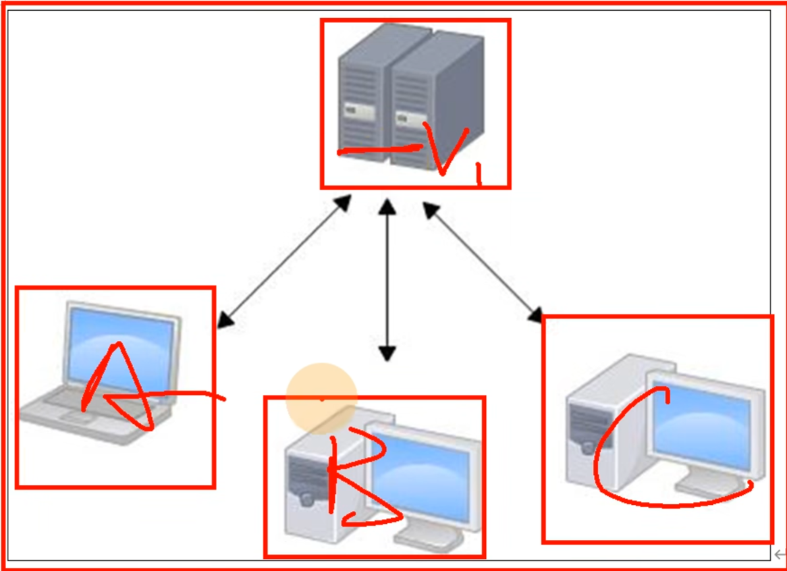

好处：管理员可以随时的观看到项目中各个工作人员在做些什么

坏处：只要是中央服务器单点故障谁都没办法修改代码进行项目

分布式版本控制工具：

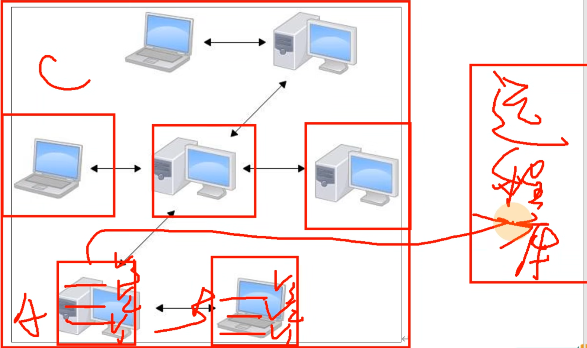

好处：解决了集中式版本控制工具的缺点保证了当远程服务器坏了的时候可以保障项目的继续维护

## 3.Git分区

git分为工作区，暂存区，本地库

图示：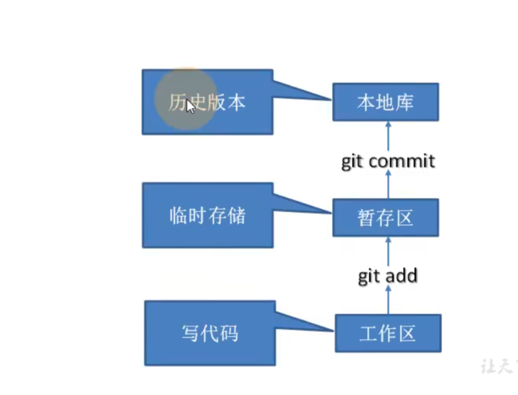

Git和代码托管中心，代码托管中心是基于网路服务器的远程代码仓库，一般我们简单的称为远程库

代码托管中心有两种：

1.局域网：GitLab

2.互联网：GitHub（外网）

​					Gitee（国内网站）

## 4.分区之间的传递

### 1.工作区到暂存区之间传输

使用vim创建一个文件 vim +文件名

工作区添加到暂存区命令是：git add +文件名

从暂存区中删除文件的命令：git  rm  --<cached>+文件名

### 2.暂存区到本地库之间传输

从暂存区中提交到本地库中：`git commit  -m` "版本日志" +文件名

查看简略版本号： `git reflog` 

查看详细的版本号：`git log`

### 3.查看历史版本

git reset --hard +简略的编号 将hard指针移动到想要切换到的版本从而实现版本穿梭

查看当前在那个版本信息·：

1.进入到git->refs->heads->masters可以用记事本打开从中看到所属的编号

2.使用 git reflog 命令可以看到指针所指的编号

git 切换版本底层就是移动的head指针


## 5.分支

在版本控制过程中，比如用户使用一条生产分支，程序员使用一条别的分支，从而要求他们不能在一条分支上面工作，我们可以创建单独的分支来为每个任务进行分配，分支可以理解为**副本**

### 1.分支的操作

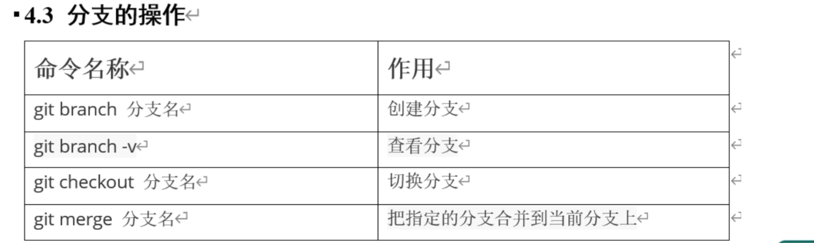

### 2.代码合并冲突问题

即两个分支在同一个位置有两条不同的修改方案系统不知道选择哪一种这时需要用户自行选择

合并以后手动的使用编辑工具进行编辑

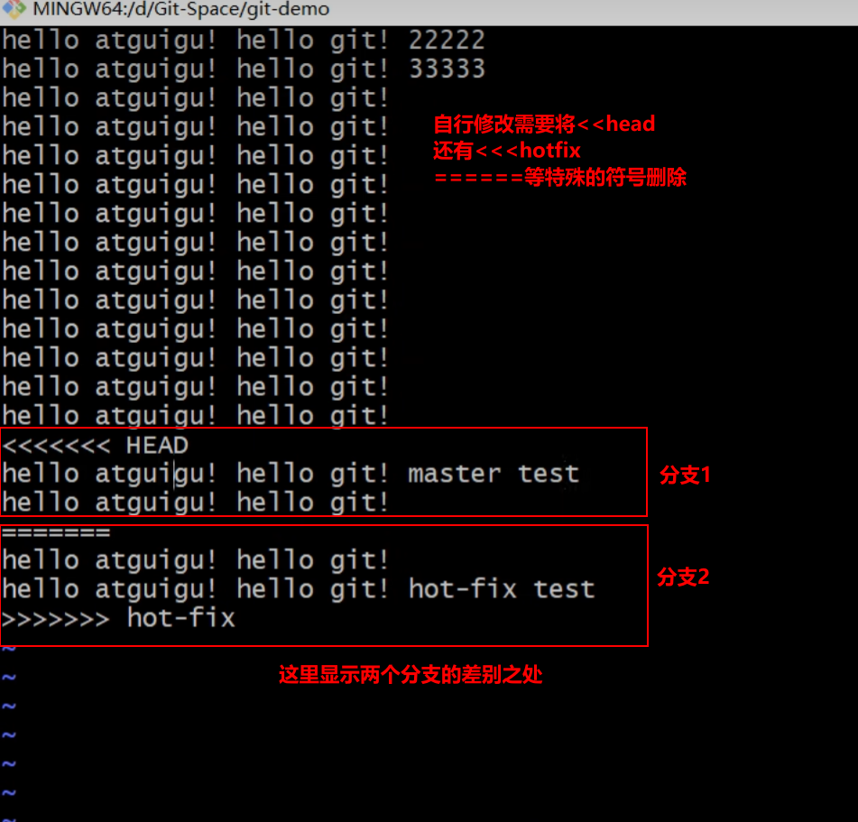

并且还有提交文件到本地库的时候git commit -m "备注" +文件名 这个操作的时候需要将文件名去掉

## 6.远程仓库操作

### 1.创建远程仓库别名

git remote -v 查看当前所有远程地址别名


git remote add 别名 远程地址  给远程地址创建别名

### 2.推送本地分支到远程库

git push 别名/原名 分支名称 

### 3.拉取远程库到本地

git pull 别名/原名 分支名称

拉取时出现问题：

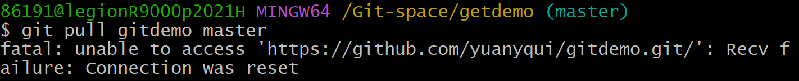

如果想要修改GitHub上面的代码结构想要删除某一个目录的话

1.当电脑存在对应的本地文件夹时，直接拉取远程信息，并更新至最新数据

`git pull college_nodes master`

2.

### 4.克隆远程库到本地

git clone +链接   就可以克隆到本地

## 7.idea集成git

### 1.idea集成git的环境配置

1. 2022.2.3版本不需要再创建.ignore文件了因为maven项目里自己带有一个.gitignore文件只需要下列代码加入到.gitignore文件中就可以了）：

   ```.ignore
   # Compiled class file
   *.class
   
   # Log file
   *.log
   
   # BlueJ files
   *.ctxt
   
   # Mobile Tools for Java (J2ME)
   .mtj.tmp/# Package Files #
   *.jar
   *.war
   *.nar
   *.ear
   *.zip
   *.tar.gz
   *.rar
   
   hs_err_pid*
   
   .classpath
   .project
   .settings
   target
   .idea
   *.iml 
   ```

   2.将.gitignore文件的路径添加到此目录中的.gitconfig文件中去格式为:

   [core]
   	excludesfile=X:/xxxx/xxxx/xxxx.gitignore(这里是.gitignore文件的位置,记得要用/正斜号而不是\反斜号)

   3. idea创建一个工程

     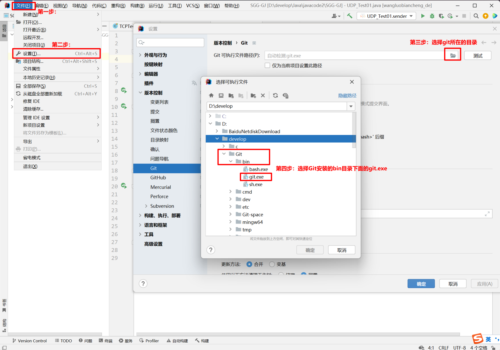

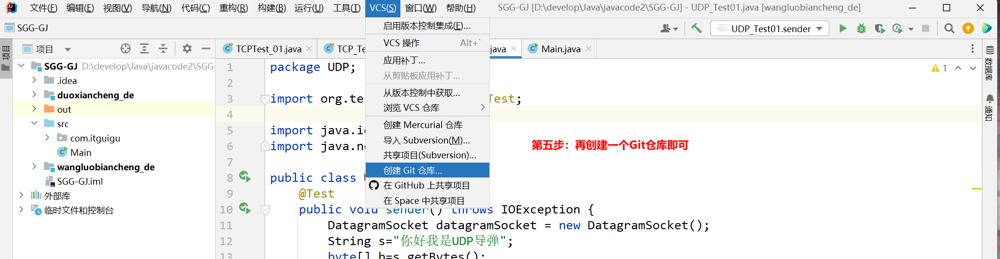

### 2.使用idea实现代码提交暂存区和提交到本地库

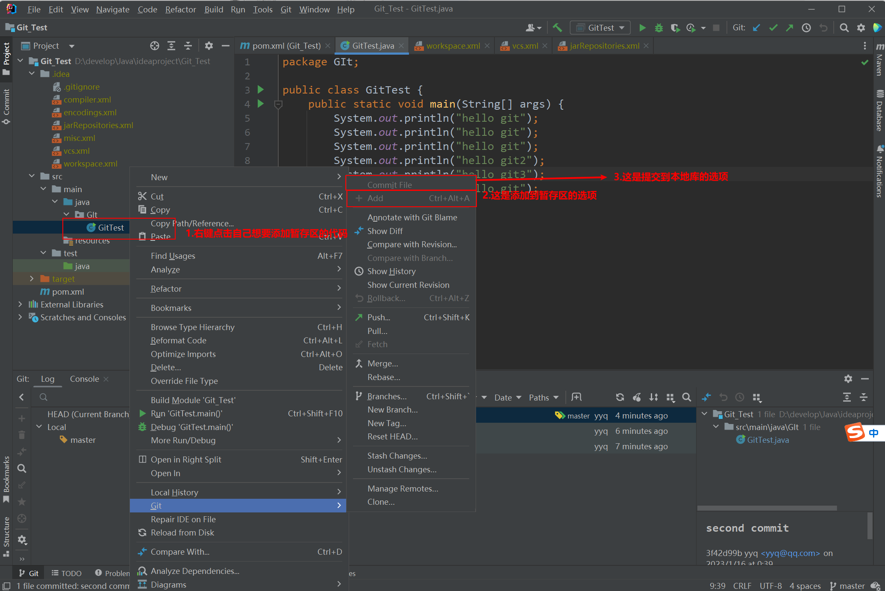

### 3.使用idea查看历史版本并且实现版本穿梭

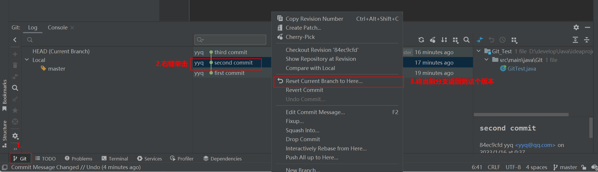

### 4.使用idea创建分支

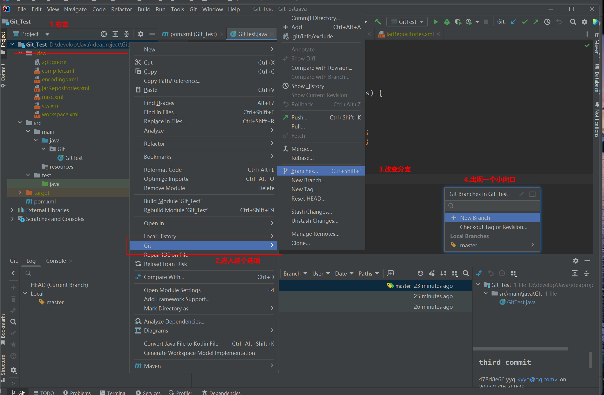

###  5.使用idea合并分支（正常）

1.前提就是已经创建了一个hot-fix分支，并且使用hot-fix分支对代码进行了修改

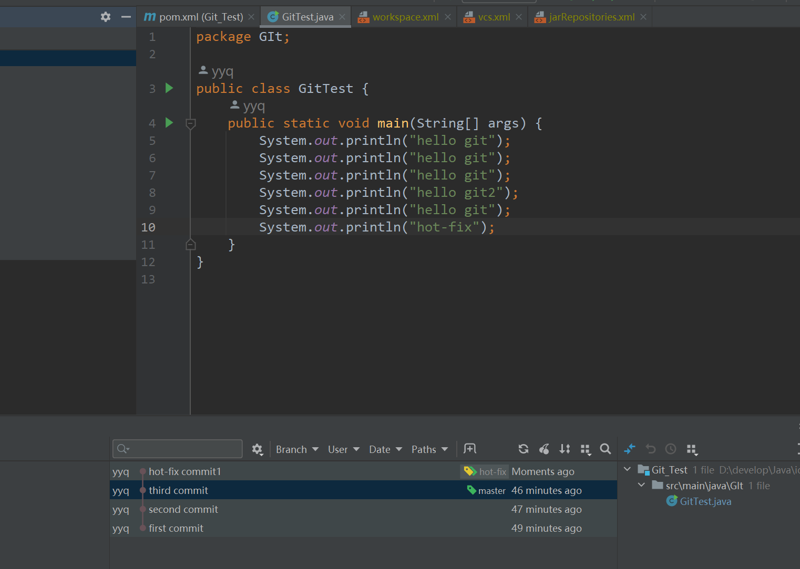

2.切换回master分支

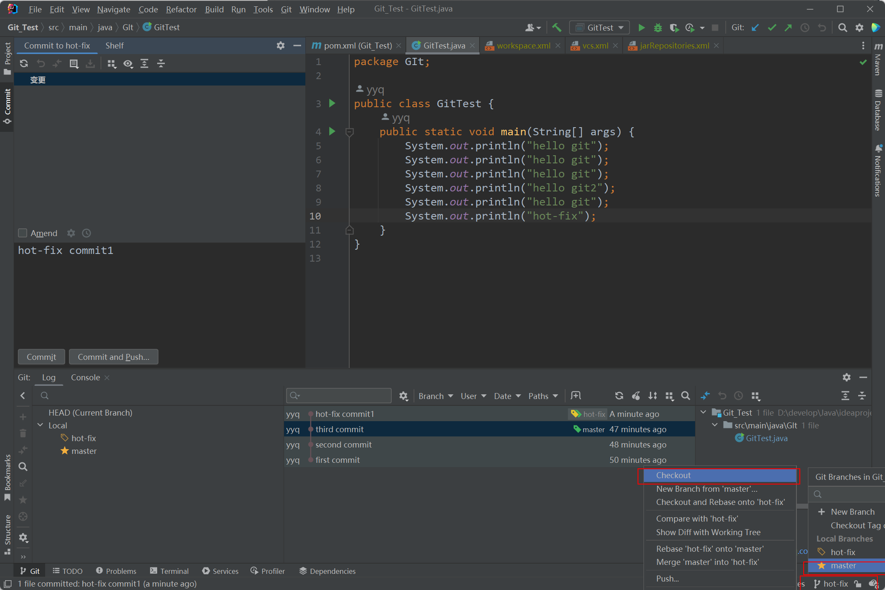

3.在master分支的前提下将hot-fix分支的内容merge（合并融入）进行合并分支


### 6.使用idea合并分支（代码冲突）

1.使用master分支写一个类

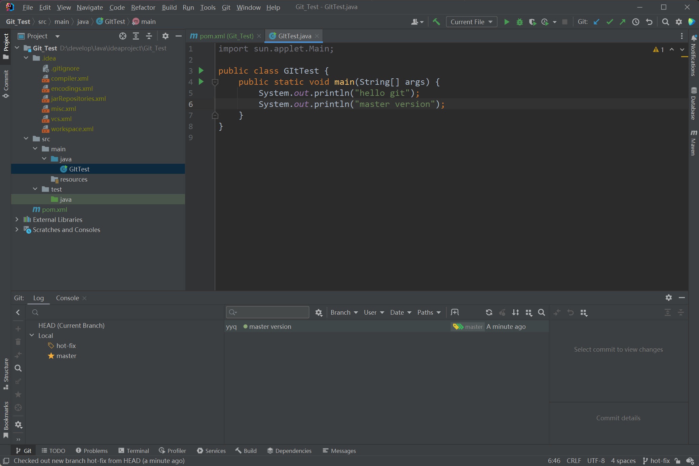

2.创建一个hot-fix分支写一个类

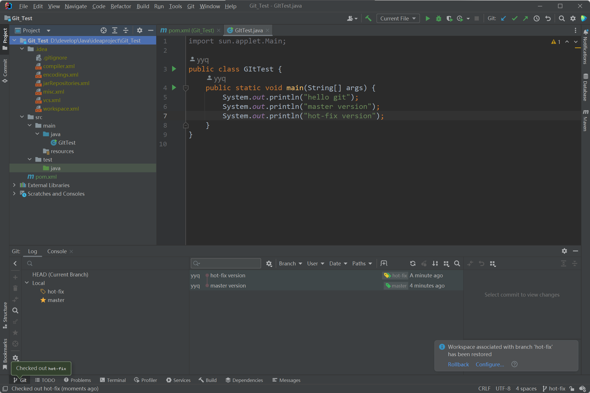

3.使用master分支再写一个类

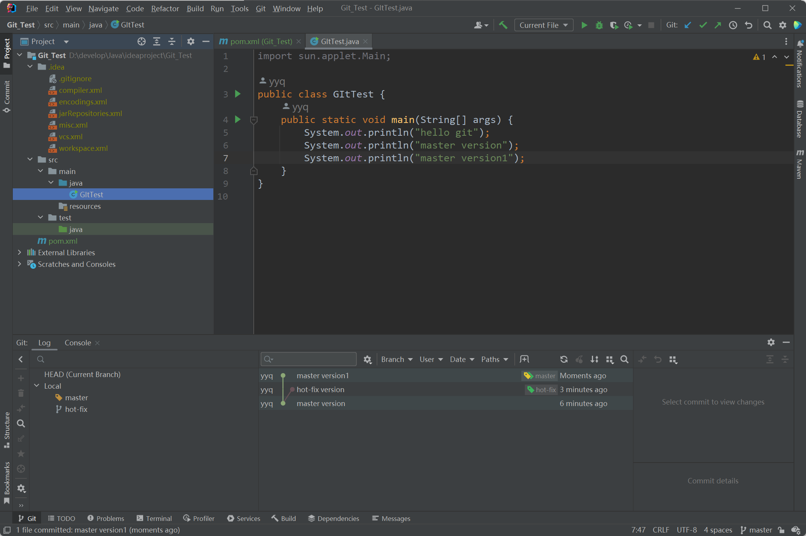

4.使用master分支的情况下合并hot-fix分支

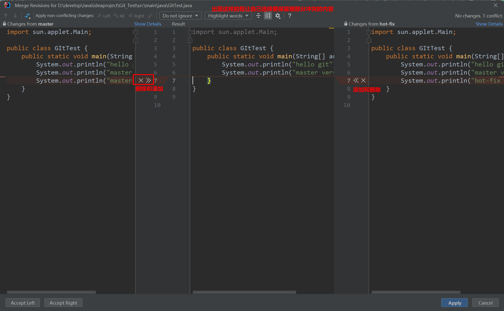

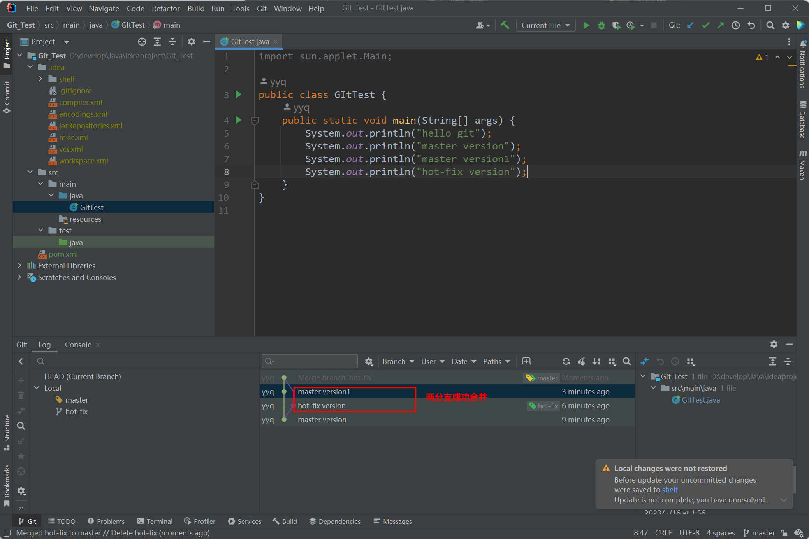

## 8.idea集成GitHub

### 1.将GitHub账号登录进去idea

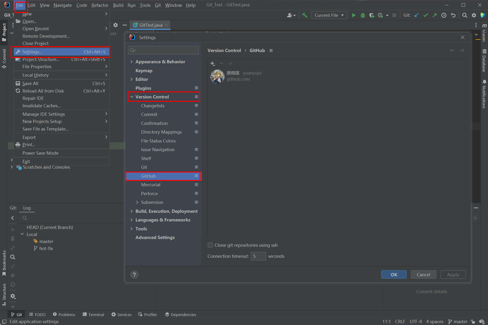

### 2.分享到GitHub上面（自动创建仓库）

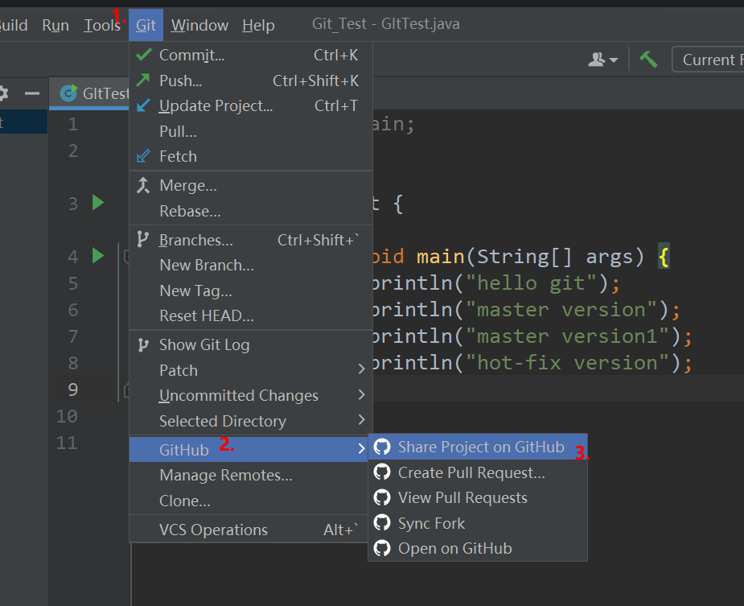

### 3.push（推送到远程库）


注意推动到远程库的时候一定要保证本地的版本比远程库的版本高，所以在修改本地的代码的时候一定要对比本地库与远程库的区别

### 4.拉取pull（从远程库拉取代码到本地库）

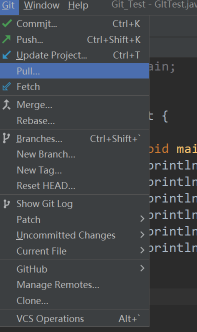

### 5.克隆从远程库克隆到本地clone

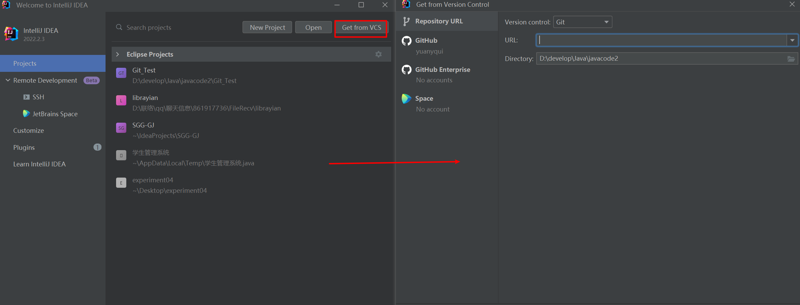

