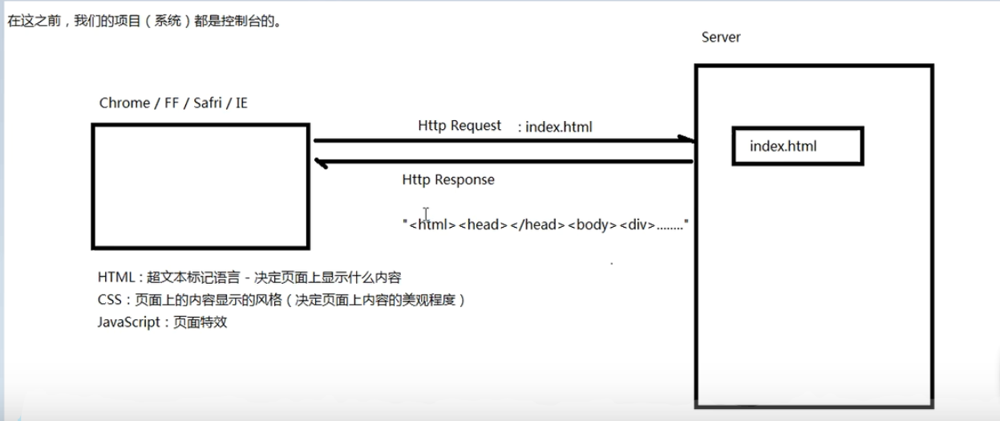
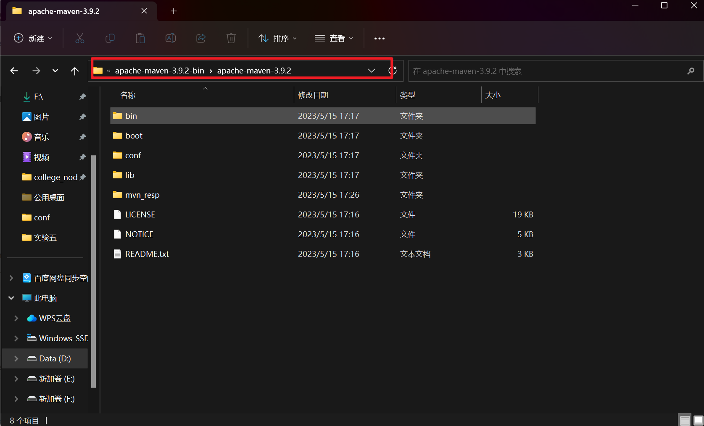
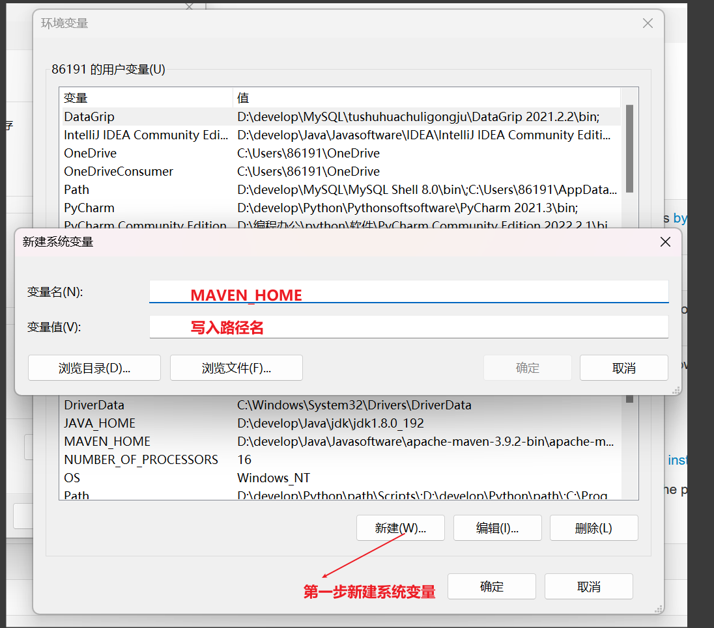
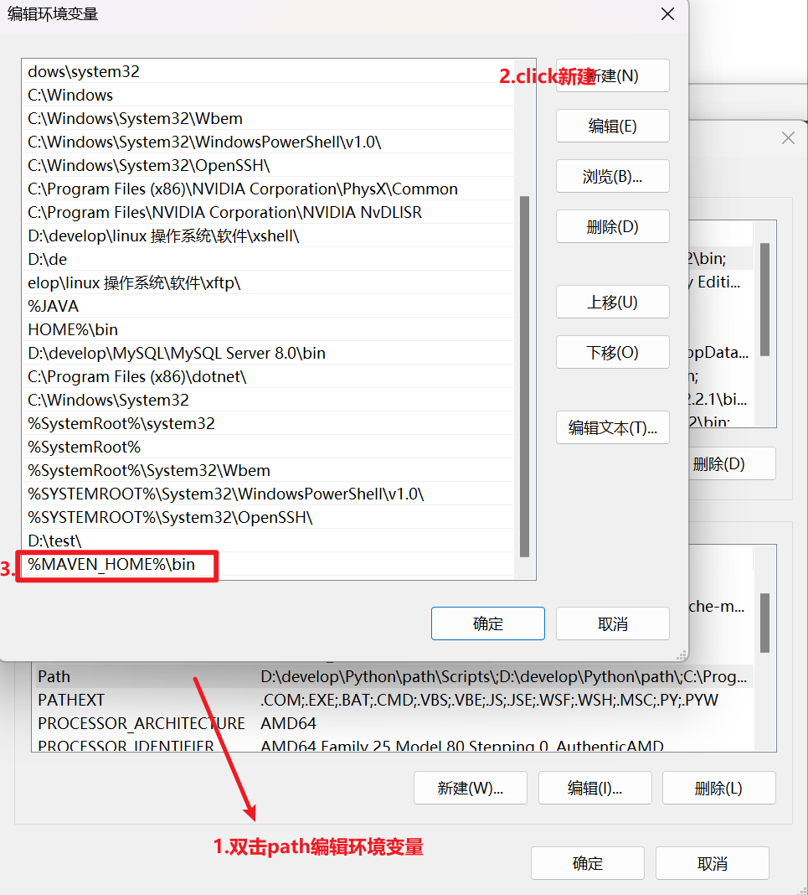
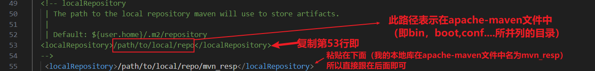
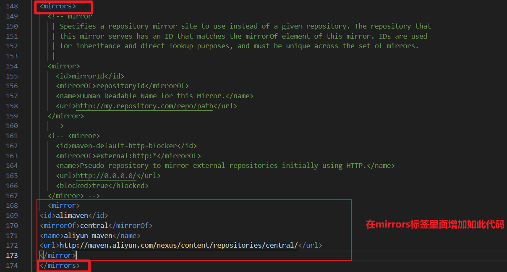
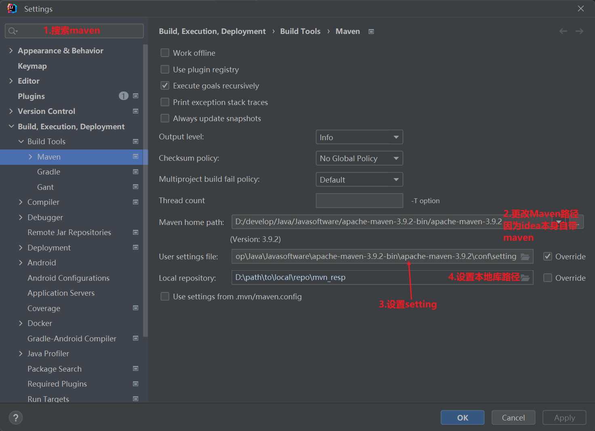
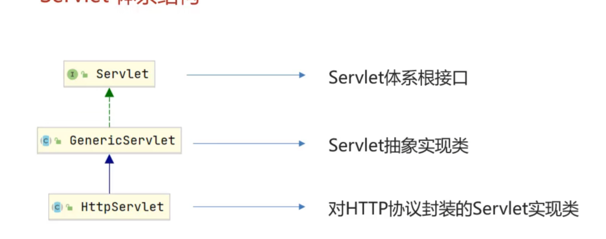
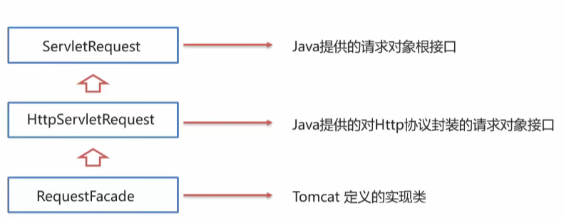
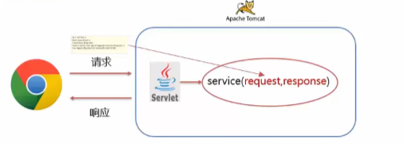

# 基础前端

导言：

## html的讲解

html的基础标签$<br/>$,$<br/>$标签是一个单标签，所谓的单标签指开始标签和结束标签是同一个，为了符合 W3C 规范，单标签必须在标签后面加一个斜杠。

# JavaScript

## 正则表达式

**概念：**表达了字符串组成的规则

**定义：**

1. 直接量：

   `var reg=/^\w{6,12}$/;`

2. 创建Regexp对象

   `var reg=new Regexp("\^/w{6,12}$\")`

3. 语法

   `^:`代表以 开始

​		`$:`代表以 结束

​		`{m,n}:`代表至少m,最多n

# Http

**概念：**超文本传输协议，规定了浏览器与服务器之间数据传输的规则

**Http协议的特点**

1. 基于TCP协议：面向连接，安全

2. 基于请求-相应模型的：依次请求对应依次相应

3. Http协议是无状态的协议：对于事务处理没有记忆功能，每次请求-相应都是独立的

   - 缺点就是不能呢共享数据（使用cookie，session）

   - 优点是速度快

**Http请求数据格式**请求数据分为三个部分

1. 请求行：请求数据的第一行，其中GET表示请求方式

2. 请求头：第二行开始,格式为**key:value**形式

3. 请求体：POST请求的最后一部分用于存放参数

**http请求最常用的两个请求方法**

1. POST
2. GET

**GET请求和POST请求的区别**

1. GET请求请求参数在请求**行**里面

2. POST请求请求参数在请求**体**里面

3. GET请求请求参数有大小限制,POST请求则没有

**Http响应数据格式**

1. **响应行：**相应数据的第一行

2. **响应头：**第二行开始，格式为key:value形式

3. **响应体：**最后一部分.存放响应数据

# Tomcat

## 简介

Tomcat是一个web服务器，是一个应用程序，对Http协议进行封装使得程序员开发更加的便捷，主要的功能是提供网上信息浏览服务。

## Tomcat-基本使用

启动：双击：bin\starup.bat

关闭：1.点击×号是强制关机

2. Ctrl+c：正常关闭

- 控制台中文乱码：修改**conf/logging.properties**

- 修改端口号：修改**conf/server.xml**

## Tomcat-集成idea
**推荐下载Tomcat插件**：（鼠标右键点击项目名为什么没有run maven）

1. 在pom.xml里面`Alt+insert`插入插件

```java
<build>
       <plugins>
            <plugin>
                <groupId>org.apache.tomcat.maven</groupId>
                <artifactId>tomcat7-maven-plugin</artifactId>
                <version>2.1</version>
            </plugin>
        </plugins>
    </build>
```

2. 在idea的setting里下载mavenhelper插件然后重启
3. 重启以后右键点击项目或是项目模块有runMaven目录然后在其下的目录里面点击install就可以了


# maven

**定义：**一套管理**java**项目的工具

- 提供了一套代码结构
- 提供了一套标准化流程
- 提供了一套依赖管理机制
**maven的坐标**
- **GroupID：**组织名
- **ArtifactID：**模块名
- **Version：**版本号
**maven的下载：**https://maven.apache.org/download.cgi

**maven的环境变量配置：**

1. 将下载解压过的apache-maven文件路径（止到打开此界面的路径）2. 添加系统变量

   

3. 编辑环境变量

**maven的本地库存储位置的设置：**

1. 打开maven的conf文件夹
2. 打开setting.xml
3. 

**配置阿里云为maven远程库**：

**好处：**可以提高速度

**方法：**1. 打开conf下面的setting.xml

2. 

代码如下

```java
<mirror>
	<id>alimaven</id>
	<mirrorOf>central</mirrorOf>
	<name>aliyun maven</name>     <url>http://maven.aliyun.com/nexus/content/repositories/central/</url>
	</mirror>
```

**idea配置maven：**



# Servlet

**定义：**是java提供的一门动态web资源开发技术（对于不同的请求有着不同的回应）

**servlet是一个接口**

## servlet方法介绍

**void init（）：**初始化方法，在servlet被创建执行的时候只会调用一次

**void service(ServletRequest req, ServletResponse res)：**提供服务方法，每次servlet被访问都会调用此方法

**String getServletInfo()：**获得servlet信息

**void destroy()：**销毁方法，当servlet被销毁的时候这个方法就会被调用

**ServletConfig getServletConfig():**得到一个servletConfig对象

**@WebServlet(urlPatterns = "/demo1",loadOnStartup = 1)：**URLpattern代表的是访问路径，loadonstarup=n,n=负整数(默认)就是第一次访问时创造一个servlet对象，n=0或正整数，数字越小优先级别越大，代表的是一旦服务器启动就立马创造servlet对象

## servlet的体系结构



在未来的开发B/S架构的web项目中，都是针对HTTP协议的，所以我们自定义servlet，会继承HttpServlet

**HttpServlet的使用步骤：**

1. 继承HttpServlet

2. 重写doGet和doPost方法

**Httpservlet原理：**

获得请求的方式并且根据不同的请求方式来调用不同的方法

**URL pattern配置：**

1. 精准路径访问

   ```java
   @webservlet("/demo/aaa")
   ```

2. 目录访问

   ```java
   @webservlet("/demo/*")
   ```

3. 拓展名访问

   ```java
   @webservlet("*/aaa")
   ```

4. 任意访问

   ```java
   @webservlet("/")
   ```

   或者是

   ```java
   @webservlet("/*")
   ```

   其中的/代表覆盖了Tomcat里面默认的Defaultservlet

   其中的优先级排名是

   精准路径访问>目录访问>拓展名访问>任意访问

   ## request

   ### request的继承体系

   

   

   

   1. Tomcat需要解析请求数据，封装为request对象，并且创建request对象传递到service方法中

   2. 使用request对象查阅javaEE API文档中的HttpServletRequest接口

## request获取请求数据

请求数据分为三部分

1. 请求行：

   `req.getContextPath()`:得到项目路径

   `req.getMethod()`:得到请求方法（POST/GET）

   `req.getRequestURI()`:得到URI（统一资源标识符[相当于项目名开头的目录]）

   `req.getRequestURL()`:得到URL(统一资源定位符)

   `req.getQueryString()`:得到请求参数(就是网站？后面跟着的username=****，password=****)，用于GET请求获取请求参数的方法

   

2. 请求头：

   `req.getHeader(String name)`:根据请求头的名称获得值

3. 请求体：

   一般POST方法的请求参数才在请求体中，所以在POST方法中获取请求参数的方法为：

   `req.getReader()`:获取字符输入流

   `req.getInputStream()`:获取字节输入流
   **request通用方式获取请求参数**

   `req.getParameter("name")`:获取单个属性返回类型是`String`

   `req.getparameterValues("name")`:获取单个属性的数组值返回类型是`String[]`

   `req.getParameterMap()`:获得所有属性的值返回类型是`Map<String, String[]> `

## request请求转发

   **实现资源转发的具体方法**

   `req.getRequestDispatcher("资源路径名").forward(req,resp);`：实现进入本路径以后自动转发进入资源路径名

   `req.setAttribute("key","value")`:储存资源代码

   `req.getAttribute("key")`:根据储存的key取出对应的value

   

   


  
