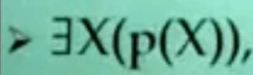
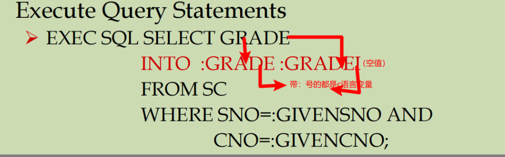
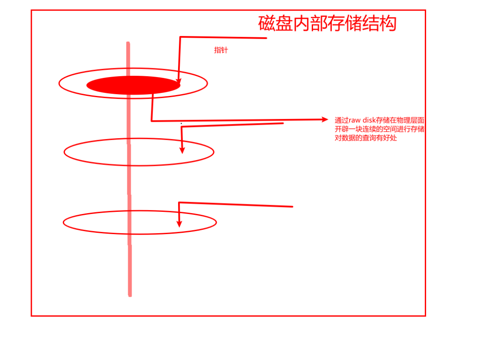
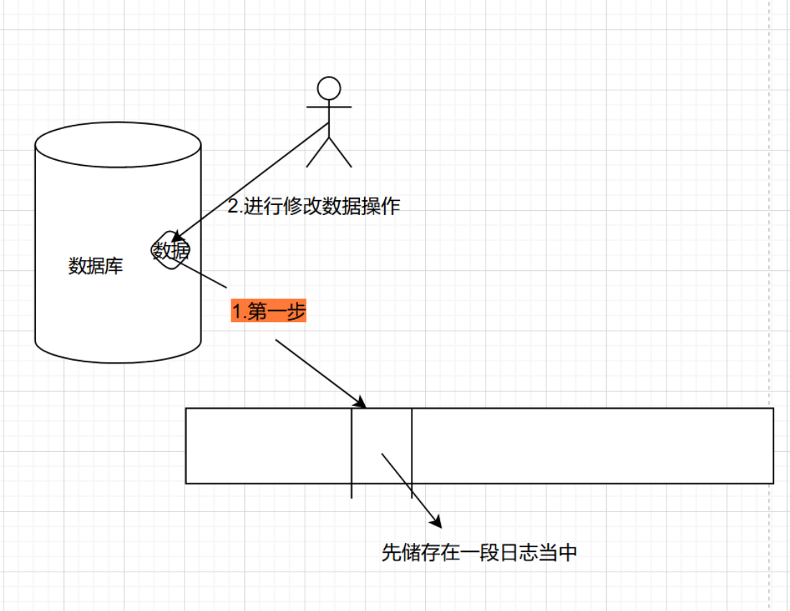
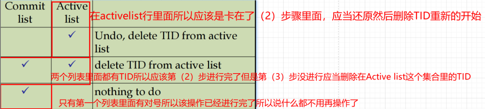
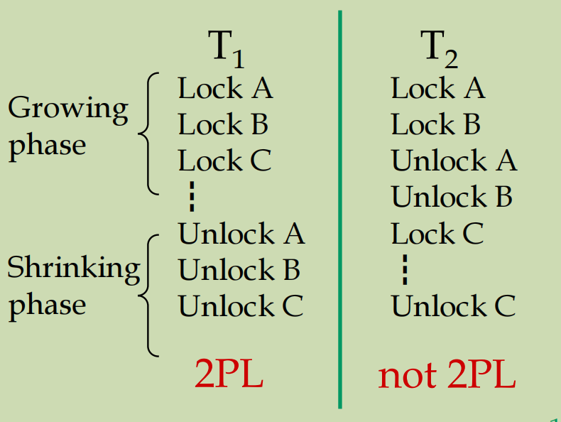

# 数据库原理与应用

# 前提提要

参考网课：

<iframe src="//player.bilibili.com/player.html?aid=14710005&bvid=BV1ux411G7Bs&cid=23977716&page=1" scrolling="no" border="0" frameborder="no" framespacing="0" allowfullscreen="true"> </iframe>

参考资料：

链接：https://pan.baidu.com/s/1o-xo0IQBJqlHUhGfEn5oYw 
        提取码：4bgv

# 大纲

 1.数据库：面向企业公司进行开发应用的一个数据集合

 2.数据模型：运用什么样的方法将数据进行存储存储方法就叫做数据模型

 3.DBMS：存储和管理系统数据的系统软件我们就把他叫做数据库管理系统database management system简称DBMS

 4.数据库分为三级模式

内模式(也称存储模式)：确定在计算机磁盘上数据存储的模式 是堆存储呢还是栈存储

 模式(也称为逻辑模式)：表的结构是什么啊 表的长度是什么啊 表的类型是什么啊

外模式(也称为子模式或用户模式)：能够看见和使用的**局部**数据的逻辑结构和特征的描述，是**数据库用户的数据视图**，是与某一应用有关的数据的逻辑表示。

 5. 数据库的三级模式是数据的三个抽象级别，他把数据的基本组织留给数据管理系统管理，使用户能逻辑地，抽象的处理数据，而不必关心数据在计算机中具体表达方式和存储方式

 6. 数据管理系统在这三个级别之间提供了两层映像

外模式/模式映像，模式/内模式映像，这两个映像保证了逻辑结构独立性和物理结构独立性

 7. 文件vs数据库为什么不用文件代替数据库进行公司的数据存储
   - 概括文件内储存的类型太简单了文件只能读取写入。
   - 文件是一个平滑的字符集，而数据库可以通过DBMS进行
   - 管理更加方便而且文件不满足多用户使用的需求
   - 还要求数据恢复
   - 还要求数据安全

## 独立性

### 1.逻辑结构独立性

逻辑模式进行改变而基于视图模式仍然没有发生改变这种独立性叫做逻辑结构独立性

### 2.物理结构独立性

当物理存储结构发生改变时，基于这个数据库开发的应用应当不会受到影响

# 数据模型

## 1.数据模型的概念

数据模型的概念：在数据库中使用这个工具来抽象，表示和处理现实世界中的数据和信息，通俗的讲数据模型就是现实世界模拟

数据模型应满足三方面要求：

* 能比较真实的模拟现实世界

* 容易被人所理解

* 便于在计算机上实现

数据模型的**组成要素：**

1. 数据结构（数据的对象的定义以及对象之间的联系）

2. 数据操作（插入，删除等方法）

3. 数据的完整性约束（教授65岁退休等）

传统的数据模型**总结**（网状结构，层状结构，关系型模型）
- 不能很好地面向用户面向应用

- 不能很完美的表达与现实世界的联系
  
- 缺乏语义信息
  
- 所支持的数据类型太少，所支持的应用领域很少。
  
- 都是面向OLTP（联机事务处理过程）应用

## 2.两大类数据模型

数据模型分为两类：

1.[概念模型](##概念模型)

2.[逻辑模型](##逻辑模型)和[物理模型](##物理模型)

将现实中的事物抽象过程--两步方法

- 将现实中的事物转变成概念模型
- 将概念模型转变为某一DBMS所支持的数据模型

## 概念模型

**概念模型的用途：**按用户的观点来对数据信息进行建模主要用于数据库的设计

**信息世界的基本概念**，例如，

- `码`：实体对应的唯一标识属性集
  例如：学生的学号是学生实体的码，
- `联系集合`：组成的n个实体
- `属性`（Attribute）列
   实体所具有的某一特性称为属性。
   一个实体可以由若干个属性来刻画。
- `实体型`（Entity Type）
    用 `实体名` 及其 `属性名集合` 来抽象和刻画 `同类实体` 称为实体型，例如：学生（学号，姓名，性别，出生日期，所属院系）
- `实体集`（Entity Set）
    `同一类型实体的集合` 称为实体集
- `联系`（Relationship）
   - 现实世界中 `事物内部` 以及 `事物之间` 的 `联系` 在信息世界中反映为实体内部的联系和实体之间的联系。
   - 实体 `内部的联系` 通常是指组成实体的 `各属性之间` 的联系
   - 实体 `之间的联系` 通常是指 `不同实体集之间` 的联系

**概念模型的一种表达方法：**实体-联系方法：该方法用E-R图来表达现实世界的概念模型，E-R方法也称为E-R模型，下图所示

- 实体型：用矩形表示，矩形内写明实体名称
- 属性：用椭圆表示，并用无向边将其与相应的实体联系起来
- 联系：联系本身用菱形表示，菱形框内写明联系名
- 联系的属性：联系本身也是一种实体型，也可以有属性，如果一个联系具有属性，则称这些属性也要用无向边联系起来

## 逻辑模型

常见的逻辑模型分为：

- 关系模型
- 层状和网状

关系模型是现在的主流模型，关系模型不允许表套表

### 关系模型

#### 关系模型的一些基本概念

- 软连接：软链接又叫符号链接,这个文件包含了另一个文件的路径名

- 属性：现实世界的事物属性都可以用表来表示刻画事物的每一个方面我们把它叫做属性，在关系模型的范围内我们要求表的每一个属性都是原子的都不能再分

- 域：每一个属性的取值范围叫做domain（域），允许一个属性是空值

- 主键（ primary key）：表中的某个属性组，它可以唯一确定一个元组。
  - 候选键（alternate key）：候选键是对具有关系键特性的一个或多个属性(组)的统称。 
    1. 这个属性集合始终能够确保在关系中能唯一标识元组。
    
    2. 在这个属性集合中找不出合适的子集能够满足条件。
    
       如果只满足第一条件则称这个属性集合称为超键。如果不只有一个主键则可以选择一个作为主键其余作为alternate（候补）key(键)。
    
   - 全键（allkey）：如果没有一个或是几个能决定这个元组的，则称为allkey(全键)。
    
     ​                             **全键，也称全码。是关系模型的所有属性组是这个关系模式的候选键。**
  
- 外键 foreign key（最重要的）：一个组通过一个键用检索到另一个组的键在自己的组叫做外键，而在外组里面叫做自己的主键像一个逻辑指针不能指空要不然会报错
  
- 完整性约束：
  
  - 域完整性约束：定义的类型与创建的类型不能不一样
  
  - 实体完整性约束：主键不能为空
  

#### 关系代数和外连接操作

##### 基础的方法

- 投影（projection）π：

  删除没有选择的属性

  结果的图形包括具体的原图形所包含的内容

  投影操作必须删除省略相同的元素
  ps:真实的数据库系统不会省略除非使用者备注执行这个操作

- 选择（selection）δ

  

- 笛卡尔积（Cross-product）×

- 集合差（Set-difference）-

- 并操作（union）U

-  连接

**定义：**笛卡尔乘积与其他五个基本操作组合而成

**种类：**    

1. 条件连接：一个关系R与一个关系S按照某一条件C做连接操作
2. 等值操作：条件连接的一种特殊情况，其中C只包含等式
3. 自然连接：所有的公共属性上的等值连接，如上述举例的同时也是自然连接

##### 除法操作

A/B={<x>| 存在<x,y>属于A任意<y>属于B}，图示:

用基本办法表示：πx(A)-πx((πx(A)×B)-A)

##### 外连接（将没有联系的两个东西连接在一起）

- 左外连接

- 右外连接

- 左右外连接

  实例

  

自我总结：哪边有*就是哪边为重

##### 外并联操作

把1两个表强行并在一起 而彼此没有的部分以null补齐

##### 关系演算

**定义：**（通过布尔表达式，运算符表达式）进行运算得出的结果就叫做关系运算

**须知：**1. SQL语言建立在关系演算之上的

2. 关系演算也可以表达关系代数的基本方法（投影，选择等）
3. 科学家已经证明过关系演算和关系代数的表达能力是一致的所以我们用SQL语言可以表达关系演算和关系代数

###### 元组关系运算

**定义：**元组（行）为关系定义变量

**查询的一般形式：**

结果全部都满足P这个函数的结果

###### 域关系演算

**定义：**以属性（列）为单位定义变量

**查询的一般形式：**

- x1,x2,x3,x4,x5,x6.......,xn+m叫做域
  变量x1,x2,x3,x4,.......,xn出现在结果中是的公式为真
- 公式由递归定义，开始由原子公式（利用公式符等构成更大的公式）
  - **原子公式的定义**：<x1,x2, …, xn> ∈ Rname ,  or X op Y,  or  X op constant，op是 <,>,=,≤,≥,≠的之一
  - **公式的定义（什么是公式）：**
    1. 一个原子公式
    2. 如果p是公式的话那么否定p,p或q,p且q就也是公式
    3. 如果p是一个公式，且X是free的
 - 安全查询和表达能力：安全查询指的是语法正确结果却包含无限个结果而不安全的查询指的是表达出无限的值关系代数里面不包含这种情况

### 非关系模型

**最早**出现的数据模型：

- 层状关系

  **定义：**一对多pcr关系

- 网状关系

  **定义：**网状数据库系统采用网状模型作为数据的组织方式

  

## 3.其他的数据模型

- 基于逻辑的数据模型
- 时态数据模型
- 空间数据模型
- XML数据模型（电子商务用的比较多）
- 其他==

## 物理模型

**逻辑模型转变为物理模型主要由机器完成**

# 数据库系统的用户接口以及SQL语言

## 1.DBMS的用户接口

**定义：**一个DBMS系统必须支持一些接口去支持用户去查询数据

### 1.第一种接口：查询语言

- 1.表格式查询语言用填写表格的方式来表达自己想要干什么

- 2.图形化查询语言

  通过图形来表达查询

- 3.受限的类自然查询语言：NITDB

- 4.在关系型数据库里面的关系查询语言

  - 1.允许从数据库中操作和检索数据
  - 2.关系型数据模型支持简单，强大的查询
  - 3.查询语言不等于程序设计语言
    它的设计是为了对巨大的数据库进行简答，强大的数据查询
  
- 5.关系型数据库的查询基础

  - 1.关系代数

  - 2.关系演算：SQL是一个非过程的语言

### 2.第二种接口：访问维护工具（GUI）

### 3.第三种接口：编程接口（APIs）

### 4.第四种接口：由访问数据库的类组成的接口叫做class Library

## 2.SQL

**最成功的关系数据库语言**

### 1.SQL种类

- 1.DDL（数据定义语言）通常是用它去定义，删除，维护数据库模式的

- 2.QL（查询语言）总是去检索数据

- 3.DML（数据操作语言）插入，删除，更新数据

- 4.DCL（数据控制语言）控制用户对数据的访问权限的

### 2.基本的SQL语句

#### 1.基本的结构

- 1.SELECT 【DISTINCT】target-list 查询指定目标 加上DISTINCT意思是结果去掉D这个元素，如果不加则不去掉，若加上则影响数据的查询效率
- 2.FROM  relation-list 从哪里查
- 3.WHERE qualification 应该满足什么条件LIKE用于字符串匹配。‘_’代表任意一个字符，“%”代表0个或多个任意字符
- 4.GROUP BY grouping-list 将SELECT得到的结果按照grouping-list的标准进行分组
- 5.HAVING group-qualification(布尔表达式)对分组后得到的组进行筛选

#### 2.一条查询语句在系统内如何执行的

总的来说有group by having 的话是这样运行的

没有的话是这样运行的

- 1.根据from字句牵扯上的表笛卡尔乘积拼起来

- 2.根据SELECT语句件进行筛选

- 3.删除不在target之中的属性

- 4.如果没有DISTINCT，就已经得到结果，如果有DISTINCT则去掉这个得到结果

- 5.通过GROUP BY语句中的group list根据分组属性值相等这个属性对经过筛选的组进行分组，分组之后就能进行筛选

- 6.HAVING按照group-qualification这个标准进行对组的筛选

- 7.最后对经过筛选HAVING过的组根据SELECT的要求去做相应的计算，每一条组得到一个结果

- 8.注意：SELECT出现的每一个属性对每一个组来说都是单一的，对于HAVING这个组的筛选条件对每个组来说也都要求是单一的，没有select出要被约束的字段的时候，也不可以使用having。

  - 例如

    原来是上面的这是一条合法的语句本意是寻找预定红色船的个数和编号如果改为

    SELECT B.bid, COUNT（*）AS scount
    FROM Boats B,Reserves R
    WHERE R.bid=B.bid 
    GROUP BY B.bid
    HAVING B.color='red'

    这是一个不合法的语句因为HAVING语句的B.color不在分组条件当中也就是说不符合HAVING是分组的一条子集这个SQL语言条件故不合法不符合SQL语法编译器,能将B.color=‘red’加到group by中

    3.如果是聚合表达式函数在SELECT或是HAVING中则不会报错

#### 3.查询语句的名词包括

- 1.UNION（把两个集合相加）

- 2.EXCEPT【把两个集合相减（集合差）】
  - EXCEPT ALL【当你确信集合中没有重复元组或者是重复元组对结果没有任何影响时使用EXCEPT ALL 不用消除重复元组，可以提高运行效率】

- 3.INTERSECT【集合的交】
- 4.EXISTS（存在）
- 5.EXISTS（EXIST是另一种集合运算符就像IN）
- 6.IN（嵌套子循环）
  - 非关联嵌套子查询 循环做一次以后循环使用
  - 关联嵌套查询（相比非关联嵌套子查询来说效率较低）

- 7.NOT IN
- 8.NOT EXISTS
- 9.NOT UNIQUE
- 10.op ANY ,op ALL, op IN <,>,=,>,<,≠
- 11.As和=号是两种方式去命名结果

#### 4.用SQL来表示除法

#### 5.SQL支持的聚集函数运算

- 1.count（*）【计算在表之中有多少个这样的元组】

​      1.查询水手这个表中水手的个数

- 2.COUNT（【distinct】A）

  1.查找名字都是Bob的但是不同级别的Bob的个数

- 3.SUM([DISTINCT] A)

- 4.AVG([DISTINCT]A)

  - 1.AVG（A）的用法 所有级别为10的水手的平均年龄
  - 查询所有级别为10的不同年龄值的平均值
  
- 5.MAX（A）

  - 1.这样写是不合法的S.age是无法对应前面的snmae的

​                      2.这样写才是合法的

- 6.MIN(A)
- 一些其他函数with as，WITH AS短语，也叫做子查询部分，定义一个SQL片断后，该SQL片断可以被整个SQL语句所用到。

#### 6.空值

**概念：**有些元组有时候是未知的 例如：有的成员的序号没有被分配或者是某个人没有配偶

空值的出现引入了许多的**难题**

- 1.特殊的运算符需要去确定（检查）值是否为空
- 2.rating>8是真的还是假的当rating与null做比较的时候，and和or和NOT也同理无法比较
- 3.我们需要设立一个三值逻辑
- 4.结构的定义必须变得细心（当你进行比较的时候值为null是就可能会被筛选下来而对象是否满足被筛选下来的条件还需要进一步的考究）
- 5.新的运算符（尤其是外连接，外并）可以通过空值来进一步的实现

### 3.一些SQL的新特性（基于tb2数据库进行）

#### 1.CAST 表达式

**基本形式：**

**作用**

改变目标数据的数据类型（类似于c,java语言的类型强转）

 **用处**

- 1.数学上实参和形参的转换
  substr(string1, CAST(x AS Integer), CAST(y AS Integer))
  方程中的一个函数CAST（）括号里面应该输入两个整型，而如果输入的是小数或是其他类型就能通过CAST进行强转
- 2.改变计算的精度
  CAST（elevation AS Decimal(5,0)）{意思为改变成一个长度为5小数点后保留0位小数点的数字}
- 3.分配一个数据类型给null

#### 2.CASE表达式

- case…END**在select执行之前执行**

- case…END**执行时遍历临时表的每一行数据，在遍历时为每一行数据提供一个动态解释内容**

- case…END**执行完毕时，生成解释数据作为一个独立的列出现在临时表**

#### 3.子查询

- 1.定义：嵌套查询3
- 2.子查询种类
  - 1.标量子查询（查询的结果就是一个值）
  - 2.表表达式（查询结果是一个表）
  - 3.公共表表达式（只计算一次多次使用）本质上就是一个临时视图

#### 4.外连接

**定义：**用SQL语句来定义外连接

#### 5.递归查询

**定义：**如果我们在一个公共表的定义里面用到了他自己那这样的一个查询就是递归查询

### 4.DDL

#### 1.插入

1. 插入一个元组到一张表中

基本语法：INSERT INTO EMPLOYEES VALUES ('Smith', 'John', '1980-06-10', 'Los Angles', 16, 45000);#插入雇员这张表值Smith', 'John', '1980-06-10', 'Los Angles', 16, 45000

#### 2.删除

1.删除元组满足条件
基本语法：DELETE FROM Person WHERE LastName = 'Rasmussen' ;#从Person这张表中删除姓为Rasmussen的人

#### 3.更新

1.更新满足条件的属性的元组值
基本语法UPDATE Person SET Address = 'Zhongshan 23', City = 'Nanjing' WHERE LastName = 'Wilson';更新Person这张表中姓为Wilson的住址和城市，改变为地址是Zhongshan 23城市是Nanjing

### 4.视图

1. 普通视图
- 1.从基表中派生的虚拟表；定义是永久保存的但是内容是虚拟的马上就会消失
- 2.逻辑数据独立性
- 3.更新视图的问题：如果数据库支持数据的更新则会通过对虚表的更改会映射到基表上面
- 4.数据的安全性：允许看到哪一个允许看不到哪一个都有规定从而确保了数据的安全性
2. 临时视图

- 1.连定义都是临时的不会被记录在数据库中
- 2.就是用with字句定义的公共字句其实就是临时视图

### 嵌入式SQL

**目的：**为了去测试在程序中访问数据库，并且采取进一步的步骤对于结果的查询，需要去把SQL语言和程序设计语言联系在一起

**程序应当满足：**

- 1.怎么样接收SQL语句

- 2.如何在DBMS和数据设计语言之间传递信息

- 3.DBMS的查询结果是一个集合，如何将其传输到编程语言中的变量中

- 4.DBMS的数据类型和程序语言不是完全的相同

**解决方法：**

- 1.[嵌入式SQL](###嵌入式SQL)
- 2.[应用编程接口](###应用编程接口)
  不同厂家对与数据提供了一组库函数对通过库函数对数据库进行访问
  例如 JDBC，ODBC（是一个标准给函数定义）
- 3.[类库](###类库（Class Library）)（Class Library）
  在OOP出现后得到支持。将库函数作为一组类访问数据库，提供了用编程语言处理数据库的更简单的方法。

**最早的解决方案** 将SQL语句通过一种方法嵌入到程序里面

**在C语言中的用法**：在C语言里面的声明

- 开头必须要以EXEC SQL开头声明，以；结束
- 通过宿主变量来在C语言和SQL语句之间传递消息，宿主变量应该用EXEC SQL来定义
- 在SQL语言中，应该用：来引用宿主变量的值，在c代码里面普通变量
- 在宿主语言（就是C）中，宿主变量被用作普通的变量
- 宿主变量不能被定义成数组或是其他结构
- 一个特殊的宿主变量SQLCA，用法为{EXEC SQL INCLUDE SQLCA
- 用SQLCA.SQLCODE去判断返回接口类型
- 用indicator（short int）去代替NULL在宿主语言（C语言）中

**可执行语句：**

- 1.连接数据库
  EXEC SQL CONNECT :uid IDENTIFIED BY :pwd;

- 2.执行DDL或者是DML语句
  EXEC SQL INSERT INTO SC（SNO，CNO，GRADE）VALUE (:SNO,:CNO,:GRADE当查询的值有多个的时候就不能把值放到一个变量里面了这时引入新的名词游标

- 3.执行查询语句

  动态SQL查询语句

  **定义：**在程序的运行过程中需要去构建查询的条件所以有了动态SQL查询语句

  **兼容性：**兼容性：大多数的SQL和RDBMS都支持动态查询

  - 1.可以直接执行动态的SQL语句

  - 

  - 2.带有动态参数的动态SQL查询语句（需要使用占位符）

    

#### 补充知识<游标>

  用宿主语言定义

1.**定义**方式：

2.**执行**方式

原理：在宿主语言中执行这条游标相当于执行对应的SQL语句，执行之后的结果就是一个集合，返回的集合看成一个文件当成一个文件，利用游标的名字访问数据就像访问文件

3.**执行**方法（通过fetch进行接收数据）

4.**结束接收**的判断

通过SQLCA.SQLCODE的返回值进行判断，当返回值为100是说明cursor这个游标已经检索到结束

5.**关闭cursor**<cursor name>

**exemple:**

### 应用编程接口

不同厂家对与数据提供了一组库函数对通过库函数对数据库进行访问
例如 JDBC，ODBC（是一个标准给函数定义）

### 类库（Class Library）

在OOP出现后得到支持。将库函数作为一组类访问数据库，提供了用编程语言处理数据库的更简单的方法。

### 5.存储过程

**定义：**定义：用于提高效能和方便用户，用户把他经常要使用的访问，完成某一组特定的操作，经过特定的编译和优化以后存储在系统中，下次使用直接调用

**功能：** 

- 1.方便用户

- 2.改进性能

- 3.提高DBMS的效能（能写入脚本）
  **实例：**

  

# 数据库管理系统

## 1. 数据库管理系统的结构

1. **DBMS的内核组成**

   

   - 1.机器访问ufi：指的是人坐在机器面前敲一条命令机器执行一条命令

   - 2.API，就是由系统提供的方法在程序中进行访问数据库，实例：嵌入式SQL，ODBC，JDBC

2. **DBMS运行下的进程结构**

   1. 单个进程运行结构.exe结构，应用程序将DBMS核心包在文件中使得文件作为单个进程进行运行

   2. 多个进程运行结构

      但是结果计算起来每一个都得另外的开一条进程故会导致系统运行十分占用资源故而推出多线程运行结构

   ​     3.多线程运行结构
   
   

## 2.数据库访问管理

**提出的前景：**对数据库的访问最终被转移到文件（操作系统）的操作。它所提供的文件结构和访问路径将直接影响数据访问的速度。一种文件结构不可能对各种数据访问都有效。

**方面：**1.访问类型：

- 1.查询一个文件中的全部或是大部分记录(>15%)
- 2.查询一些特殊的记录
- 3.查询一些记录（<15%）
- 4.范围查询
- 5.更新（写操作）

2. 文件形式

 - 1.堆文件：最基本最简单的存储结构，查询需要从头到尾顺序扫描，添加直接添加到末尾
 - 2.哈希文件：记录的属性被定义成哈希函数，记录地址通过哈希函数根据某些属性的值进行映射。查询效率高
 - 3.索引文件：索引＋堆文件
 - 4.动态查询
 - 5.栅格结构文件：适用于多属性查询
 - 6.raw disk：在物理存储的方面上申请下来一块连续的空间对数据进行存储

3. 索引技术

- 1.B+树索引

- 2.集群索引：本身按照顺序进行存储叫做集群索引

- 3.倒向索引

- 4.动态哈希索引

- 5.位图索引

- 6.栅格结构文件和分区的哈希函数

- 7.其他

- 8.聚簇索引是一种对磁盘上实际数据重新组织以按指定的一个或多个列的值排序。由于聚簇索引的索引页面指针指向数据页面，所以使用聚簇索引查找数据几乎总是比使用非聚簇索引**快**。每张表**只能建一个聚簇索引**，并且建聚簇索引需要至少相当该表`120%`的附加空间，以存放该表的副本和索引中间页。

4. 访问原语

## 3.查询优化

**含义：**重写”用户提交的查询语句，然后确定最有效的操作方法和步骤。目标是以最低的成本和最短的时间获得用户的查询结果。

### 1.代数优化

**依据：**等价变化的规则

- 1.⋈/×的交换律E1 × E2 ≡ E2 ×E1

- 2.⋈/×的结合律 E1×(E2×E3)≡(E1×E2)×E3

- 3.投影（π）操作的串接率，有一个前提，这个条件成立当B1,B2,B3,B4,B5........Bm是A1A2A3A4A5......An的子集时条件成立

- 4.选择操作的串接率（连续的两次选择的条件是可以合并的）

- 5.投影和选择的交换律如果F包含属性B1......Bm这些不是A1...Am的子集那么

- 6.如果在F中的属性是所有的在E1中的属性，那么

  - 如果在F以F1∧F2的形式存在，且F1只在E1中存在，且F2只在E2中存在的那么

  - 如果在F以F1∧F2的形式存在，且F1只在E1中存在，且F2在E1，E2中都存在的那么

- 7.

- 8.

- 9.假设A1....An是一个属性的集合，其中B1.....Bm是E1的属性，并且C1....Ck是E2的属性，所以

- 10

  **含义：**对原始数据进行一系列的转换，并将其转换成等效的，最有效的执行形式

  **查询数：**

  **基本原则：**

  1.通过将一元操作尽可能的压低

  2.寻找并组合公共子表达式

### 2.操作优化

操作优化的步骤：

1. 确定两个连接操作有许多的计算方法

2. 对于每种连接操作都有许多计算方法

   **定义：如何找到一个好的访问策略来计算通过代数优化改进的查询主要考虑这几个方面：**

   1. 选择操作怎么进行优化
   2. 项目操作如何进行优化
   3. 设置操作的优化
   4. 连接操作如何进行优化（在关系型数据库中对结果影响最大的因素）
   5. 组合操作的优化

主要了解一下在`关系型数据库`中对结果影响最大的因素即`连接操作如何进行优化`

1. 实现连接操作的最基本方法：嵌套循环
   一个关系作为外部循环关系(O)，另一个关系作为内部循环关系(I)。对于O中的每个元组，我扫描一次以检查连接条件。
   由于关系是以块为单位从磁盘访问的，所以我们可以使用块缓冲区来提高效率。对于R链接S，如果让R为O，S为I，bR为R的物理块数，bS为物理块数S，系统中有n块缓冲区，给外层n-1块，给内层1块，那么总磁盘访问时间为$b_R+[b_R/(n_B-1)]×b_S$

   尽可能给外层分配足够多的内存的原因：每次循环外循环结束，内循环都要重新读，分块分多少每一次的I/O时间都一样，并没有改变,如图示：

2. 归并扫描，即**提前排好顺序以后才能进行归并扫描**

3. 使用B+树索引或是哈希表进行找寻映射元组

## 4.恢复机制的概述

1.这是企业级数据库所要必须具备的能力

**2.功能：**

1. 减少数据发生故障的可能
2. 从故障中恢复

**策略：**

1. 定期的dumping

​        新的变种：备份+增加的dumping

2. 备份+日志

- **日志（log）**：自从上次备份以来数据库所做的每一次改变

   日志记录的内容

​						对于不同内容的日志所作的不同内容

​		

- **恢复时：** 

​		当一些的事务（transaction）进行到一半的时候应该恢复以旧值
​				当一些事务（transation）已经完成但是结果还没有写进数据库则应该用新值来进行代替

- **好处是：**

  不会产生丢失的操作

  **3.一些恢复时用到的数据结构：**

  1. commit list：所有现在已经完成的TID（事务标识号）组成的列表，TID表示在每进行一次begin transaction进行一次时候系统都会给他分配一个ID号就叫做TID（事务标识号）
  2. active list:在进程中已经完成的TID列表
  3. 日志：

  **4.数据库在恢复的时候必须要遵循的规则**
  
  - 提交规则
  
    新值事务被提交之前必须的写入到不容易丢失的存储设备里面
  
      
    
  - 先记后改规则
  
    先将修改的数据存进不易丢失的地方，然后进行修改
  
    
    
  - 恢复策略
  
    redo和undo的特征
  
    
  
    无论旧值undo（撤销，还原）几次都等于undo一次
  
    无论新值redo（重做）几次都等于redo一次

## 5.事务管理（并发控制）

transactions就是一段SQL语句对数据库进行修改，他有以下的特征

- 1.原子性：不可再分了，最基本的操作
- 2.保持一致性：数据库本来的是一致的，经过事务运行保持另外一种一致性运行
- 3.隔离性：同时运行的事务不能相互影响
- 4.持久性：一个事务只要是被完成，他是永远的反应于数据库的，以后再恢复数据库，这个反应也是存在的

## 6.更新策略以及故障之后的修复

三种更新的策略

- 先存后改原则

- 

中断之后的恢复，在这种情况下，检查两个表对是否含有TID

- 提交原则

  

中断之后的恢复，在这种情况下，检查两个表对是否含有TID

- 两条规律相结合

  

中断之后的恢复，在这种情况下，检查两个表对是否含有TID

## 7.并发控制方法

**概念：**在多用户DBMS中，允许多事务同时并发访问数据库。

**作用：** 1. 提高了系统的利用率和访问时间

   2. 不同的事物可以访问数据库的不同部分

**并发控制引发的问题：**

1. 写-写冲突问题

   

2. 读脏数据问题

     

   引发的多米诺反应

3. 不可重复的读

   

**可串行化：** 对于事务集(T<1>,T<2>,…,T)，如果一个并发调度的结果与一个串行调度等价，则称此调度是是可串行化调度

**封锁法：**

1. 排它锁（X锁）：不管对数据库中的数据进行读还是写都申请排他锁

   当一个事物在申请锁的时候会得到

   相容矩阵：

**两段枷锁协议**

- 定义一：在一个事务中如果所有的枷锁请求都在所有的锁释放之前，那么说这个事务是两阶段事务，这个限制就叫做两段枷锁协议
- 定义二：在一个事务当中如果它在获得一个锁在解开锁之前，那么它就叫做well-formed

**定理：**如果一个事务是两阶段锁协议并且是well-formed那么他就是可序列化的

2. （S-X）锁

   S锁：如果打算读取

   X锁：如果打算更新操作

   

3. （S-U-X）锁

   U锁：更新的锁，在一个修改更新的过程当中获得一个U锁并且接下修改的时候更新U锁为X锁 

   目的是为了缩短排他的时间，从而提高了当前的进度减少了死锁的时间

**死锁：**循环的等待倒置任何的事务没有办法得到他所需要的资源和需要去完成

**活锁：**虽然其他事务在有限的时间内释放资源，但有些事务在很长一段时间内无法获得所需的资源

**解决死锁的方法**

1. 防

   - 方法一：如果事务等待指定的时间，则假设为死锁，并且应该中止事务。

   - 方法二：查找死锁通过构造等待图的方法，绘制的等待图E=<V,E>

     V（顶点的集合）:等待的事务集合$\{T_i|T_i是DBS的一个事务\}$

     E:（边的集合）$\{<T_i,T_j>\}$当$T_i等待T_j$的时候就把两条边连接在一起

     如果图像中出现圆圈那么就说明出现了死锁

2. 治

   - 挑选一个事务

   - 终止这个事务并且释放它的锁和资源

   - 滚回之前

   - 重启这个锁

**每一个事务都有一个独特的事务铭刻**如果$T_A$需要锁定已经被$T_B$锁定的数据对象，则使用以下方法之一：

- 等待死亡：如果$T_A$比$T_B$老则等待，否则它“死亡”，即它被中止，并自动使用原始时间戳自动重试。

- 将会等待：如果TA比TB年轻时等待，否则它将“伤口”TB，即TB被中止，并使用原始时间戳自动重试

  在上示中，两者都只有一个方向等待，年长的→年轻，年轻的→年长。在循环中不可能发生等待，所以避免了死锁。

# 安全性和完整性约束

**介绍：**数据库的破坏通常由以下的几点造成

1. 系统的故障

2. 并发访问导致的不一致

3. 认为破坏（有意或无意）

4. 输入的数据不正确更新的事物未遵守一致性保持规则

   以上所述的几点，1,2可以通过DBMS的恢复机制解决

   3属于数据库的安全，4属于完整性约束

**数据库的安全性：**

- 保护数据库不被非法访问

  1. 视图和查询修改

  2. 访问控制

     a.普通用户

     b.具有特殊资源的用户

     c.数据库管理员
  
  3. 用户的识别和认证
  
     - 密码
  
     - 特殊物品，如钥匙，IC卡等
  
     - 个人特征，如指纹，签名等
  

    4. 授权
       - 给特定用户授权
       - 对特定的对象进行授权

