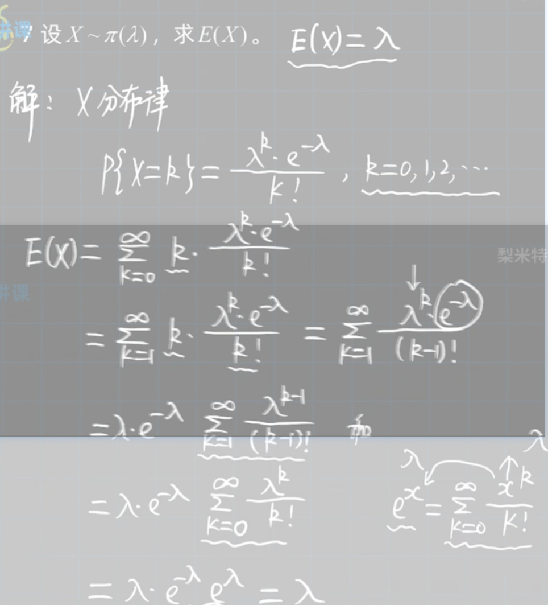

# 概率论与数理统计

## 第一章：概率论的基本概念

### 1.随机事件的基本特点：

1. 可重复性

2. 可观察性（结果不是只有一个）

3. 不确定性（无法预测）

### 2.样本空间和随机事件

#### 基本事件

相对于实验目的不能再分（不必再分）

#### 复合事件

由基本的事件符合组称

Ω代表样本全集也就是必然事件

φ代表空集也就是不可能事件

##### 必然事件：用Ω表示代表一定发生事件这不是随机事件

##### 不可能事件：φ表示就是不可能发生的事件这也不是随机事件

#### 样本空间

所有基本事件所有可能发生的结果组成的集合，用Ω表示

#### 样本点

样本空间的元素，用ω表示

#### 事件之间的关系

1. 包含⊂,⊃.A⊂B代表A发生必定导致B发生

2. 并(和)∪,A∪B(A+B)A和中至少有一个发生的事件

3. 交(积)∩,A∩B(AB),指代A,B同时发生的事件

4. 差，A-B ,A发生而B不发生，A-B就相当于去掉AB的公共部分A-B就相当于A-AB相当于$A∩\overline{B}$也就是$A\overline{B}$

5. 互不相容事件，A，B不同时发生
   

6. 对立事件，A，B互不相容且A∪B=Ω，AB=φ且A+B=Ω，如果A+B=φ，那么称作$A$=$\overline{B}$，或者是$B$=$\overline{A}$

   

   

   

   1. $\overline{A}$是$A$的逆,所以$\overline{\overline{A}}$=$A$
   
   2. $A-B=A-AB$=$A\overline{B}$.
      
      ##### 联系与区别
      
      1. 两事件对立，则一定是互不相容的
      2. 互不相容适用于多个事件 对立只适用两个事件
      3. 如果两个事件互不相容表示不可能同时发生也可以都不发生，对立事件一定有一件事发生
   
   ##### 无限可列个：
   
   按照某种规律排成一个序列，例如
   
   1. 自然数：0,1,2,3,4,5,6,.....
   
   2. 整数：0,1,-1,2,-2,3,-3,4,-4....
   
   3. 无理数：
      $$
      0,\frac{1}{1},-\frac{1}{1},\frac{1}{2},-\frac{1}{2},\frac{1}{3},-\frac{1}{3}....
      $$
   
7. 完备事件组
   
      A~1~,A~2~,A~3~,A~4~,A~5~,……A~n~两两互不相容，且
      $$
      \sum_{i=1}^{n}Ai=Ω
      $$

如图所示

#### 事件的运算

1. 交换律$(A∪B)∪C=A∪（B∪C）$

2. 结合律$(A∪B)∪C=A∪（B∪C）$$(A∩B)∩C=A∩（B∩C）$

3. 分配率$(A∪B)∩C=(A∩C)∪(B∩C)$
   $(A∩B)∪C=(A∪C)∩(B∪C)$

4. 对偶$\overline{A∪B}$=$\overline{A}∩\overline{B}$
   $\overline{A∩B}=\overline{A}∪\overline{B}$记忆方法：长线变短线符号要改变

### 3.频率与概率

- 概率的描述性定义

  称随机事件A发生的可能性大小的量度（非负值）为事件A发生的概率

- 概率的统计性定义

  概率的统计性定义-----频率：定义就是在相同条件下进行了n次实验，在这n次实验中，事件A发生的次数为n~A~，称为事件A发生的频数，比值$\frac{n~A~}{n}$称为事件A发生的频率，并记作$fn(A)$

- 概率的公理化定义

  设E是随机试验，S是他的样本空间，对于E的每一个事件A赋予一个实数，记作P（A）如果集合函数P（.）满足下列条件：

  1. 非负性：对于每一个事件A有P（A）>0；

  2. 规范性：对必然事件S，有P（S）=1；

  3. 可列可加性：设A~1~，A~2~，A~3~，A~4~，.......,A~n~,.......是两两互不相容事件即A~i~A~j~=φ，$i\neq{j}$,i,j=1,2,3,4,5,....,n,...,有
     $$
     P(A~1~∪A~2~∪A~3~∪...∪A~n~∪....)=P(A1)+P(A2)+P(A3)+P(A4)+...+P(An)+.......
     $$
     

#### 1.频率的基本性质

$(1)0\geq{f~n~}\leq1$
       $(2)f~n~(S)=1(必然事件的发生频率为1)$
      (3)[有限可加性]若A~1~，A~2~，A~2~,......A~k~,是两两互不相容的事件(即形成完备事件组)，则$$f(A~1~∪A~2~∪A~3~∪...∪A~k~)=f(A1)+f(A2)+f(A3)+f(A4)+...+f(Ak)$$

注：频率的大小代表A发生的频繁程度，频率大事件A发生就越频繁，这就意味着事件A在依次试验中发生的可能性大就大。

#### 2.概率重要性质

性质1（不可能事件发生概率为0）:
$$
P(φ)=0
$$
性质2(有限可加性):*利用的是可列可加性推导出有限可加性反之推不出来*
$$
f(A~1~∪A~2~∪A~3~∪...∪A~k~)=f(A1)+f(A2)+f(A3)+f(A4)+...+f(Ak)
$$

性质3(减法性质):设A，B是任意两个事件，则
$$
P(A\overline{B})=P(A-B)=P(A)-P(AB)
$$

证明：

性质4（单调性）：设A，B是两个事件，若B$\subset$A ,则
$$
P(A-B)=P(A)-P(B)，P(A)\geq{P(B)}
$$
性质5（有界性）：对任意一个事件A，有$P(A)\leq1$

性质6（逆事件概率）：对任一事件A，有
$$
P(\overline{A})=1-P(A)
$$
性质7（加法公式）：对于任意的两个事件A,B,有
$$
P(A∪B)=P(A)+P(B)-P(AB)
$$
推广：
$$
P(A∪B∪C)=P(A)+P(B)+P(C)-P(AB)-P(AC)-P(BC)+P(ABC)
$$
证明：

### 4.古典模型

#### 中学概率知识

**加法原则**：设一个事情的完成有n类方法（只需要完成其中一个方法既可以完成这件事情），若第一类方法m~1~种，第二类方法有m~2~种，第三类方法有m~3~种，第四类方法有m~4~种，........，第n类方法有m~n~种，则完成这件事情一共有N=m~1~+m~2~+m~3~+m~4~+.......+m~n~种方法

**乘法原理**：设一件事情有n个步骤（都完成的时候才能算完成这件事情），若第一步有m~1~种方法，第二步有m~2~种方法，第三步有m~3~种方法，.........第n步有m~n~种方法，则完成有N=m~1~×m~2~×m~3~×m~4~×......×m~n~种方法。

**排列** 从n个不同的元素中任取m（m$\leq$n）个按照一定顺序排成一列，称为从n个不同的元素中取出m个元素的一个排列，从n个不同的元素中取出m个元素的所有排列种数，记作
$$
P^m_n=n(n-1)(n-2)...[n-(m-1)]=\frac{n!}{(n-m)!}
$$
从n个不同的元素中**全部取出**的排列成为胡全排列，其排列的种数，记作$P_n=n!$.

**允许重复的排列** 从n个不同的元素中**有放回**的取m个按照一定的顺序排成一列，其排列的种数有N=n×n×n×....×n=$n^m$

**组合**  从n个不同的元素中取出m个元素，不管其顺序如何并成一组，称作从n个不同的元素中取出m个元素的一个组合，其组合的总数是
$$
C^m_n=\frac{P^m_n}{m!}=\frac{n!}{m!(n-m)!}
$$
组合与排列之间的联系
$$
P^m_n=C^m_nm!(排列就是随机组合的全排列)
$$

**[注]** 有顺序用排列，无顺序用组合

#### 古典模型定义

若随机试验E满足：
（1）样本空间S只含有限个样本点，S={e~1~,e~2~,e~3~,e~4~,.....e~n~}
（2）每个基本事件（样本点）发生的可能性相同；则称此随机试验的概率模型为等可能概型，也称为古典概型

古典概型中，事件A={e~i1~，e~i2~,.....,e~ik~}发生的概率为
$$
P(A)=\frac{k}{A}=\frac{A包含的基本事件数}{S中基本事件的总数}
$$
**注：** 求P(A)时，只需找出k,n就可以，与样本点具体是什么无关的

### 5.几何模型

#### 几何模型定义：

若随机试验E满足

（1）样本空间S是$R^n$(n=1,2,3)中一个可度量的几何区域

（2）每个样本点出现的概率相等，即样本点落入S某一可度量的子区域A的可能性大小与A的几何度量成正比，而与A的位置及形状无关

则事件A={样本点落入区域A}的概率为
$$
P(A)=\frac{A的集合度量(长度，面积，体积)}{S的几何度量(长度，面积，体积)}
$$
 **注**：（1）古典模型和几何模型的区别和联系

|   名称   | 基本事件数量 | 可能性的大小 |
| :------: | :----------: | :----------: |
| 古典模型 |     有限     |    等可能    |
| 几何模型 |     无限     |    等可能    |

（2）求解几何模型，关键是画出题目涉及的区域，并求其度量

### 6.条件概率

#### 1.条件概率的定义

设A，B是两个概率，且P（A）>0，称P（B|A）=$\frac{P(AB)}{P(A)}$为事件A发生的条件下发生事件B的概率。

注：要注意P(AB)与P(B|A)的区别；

P(AB)是在样本空间为S时候，A，B同时发生的可能性

P(B|A)则表示在A发生的条件下，B发生的可能性，此时的样本空间已由S缩减到A.

#### 2.条件概率的性质

$(1)P(B|A)\geq0$

$(2)P(S|A)=1,P(φ|A)=0$

$(3)P(B∪C|A）=P(B|A)+P(C|A)-P(BC|A)$

$(4)当B，C互不相容时，P(B∪C|A)=P(B|A)+P(C|A);$

$(5)P(B-C|A)=P(B|A)-P(BC|A)$

$(6)P(\overline{B}|A)=1-P(B|A)$

### 7.乘法公式

设P(A)>0，则有
$$
P(AB)=P(A)P(B|A)
$$
上式称为乘法公式

设P(B)>0.则有
$$
P(AB)=P(B)P(A|B)
$$
上市称为乘法公式

**推广：**

（1）设A，B，C为事件，且P(AB)>0,则有
$$
P(ABC)=P(A)P(B|A)P(C|AB)
$$
(2)设A~1~，A~2~，A~3~，A~4~，A~5~，A~6~，……，A~n~为n个事件，$n\geq2$,且

P(A~1~，A~2~，A~3~，A~4~，A~5~，.....A~n-1~,A~n~)=P(A~1~)P(A~2~|A~1~)P(A~3~|A~1~A~2~)...P(A~n~|A~1~A~2~A~3~...A~n-1~).

### 8.全概率公式 贝叶斯公式

#### 全概率公式

引入：设样本空间为S，A为E（随机试验）的事件，B~1~，B~2~，B~3~，.....B~n~为S的划分，且P（B~i~）>0(i=1,2,3,4,.....,n),那么P(A)=？

推导：由已知S=B~1~∪B~2~∪B~3~∪....∪B~n~

​			P(A)=P(AS)=P(A(B~1~∪B~2~∪B~3~∪.....∪B~n~))

​					 =P(AB~1~∪AB~2~∪AB~3~∪......∪AB~n~)

​                     =P(AB~1~)+P(AB~2~)+P(AB~3~)+P(AB~4~)+....+P(AB~n~)

​                      =P(B~1~)×P(A|B~1~)+P(B~2~)×P(A|B~2~)+....+P(B~n~)×P(A|B~n~)
$$
P(A)=\sum^n_{i=1}P(B_i)×P(A|B~i~)
$$
注：

（1）若把全概率公式中的A视为"果"，把B~1~，B~2~，B~3~，.......B~n~视为因，则全概率公式反应的事“**由因求果**”的概率问题

（2）应用时首先要对所涉及的事件赋予概率符号

（3）关键是找到导致事件B发生的样本空间的一个划分

#### 贝叶斯公式

定理：设E（随机试验）的样本空间S，A是E（随机试验）的事件，B~1~，B~2~，B~3~，.....，B~n~为S的一个划分，且P(A)>0,P(B~i~)>0(i=1,2,3,.....,n),则
$$
P(B~i~|A)=\frac{P(AB~i~)}{P(A)}=\frac{P(B)P(A|B~i~)}{\sum_{j=1}^{n}P(B~j~)×P(A|B~j~)},i=1,2,3.....,n
$$
注：

（1）此公式先是应用条件概率公式，分母是全概率公式，是n项之和，分子利用了乘法公式，分子是分母的一部分，贝叶斯公式：**由果导因**。

（2）形式平淡，但富有哲理，贝叶斯统计应用广泛

### 9.独立性

#### 1.描述性定义

设A，B为两个事件，如果其中任何一个事件发生的概率不受另一个事件发生与否的影响，那么就称事件A与B相互独立

#### 2.数学定义

设A,B是两事件，若满足
$$
P(AB)=P(A)×P(B)
$$
则称A,B相互独立简称独立

注：与事件的:包含，相等，相容，对立关系不同从概率角度定义

#### 3.判断定理

定理一：设A，B是两事件且P(A)>0,若A,B相互独立，则P(B|A)=P(B)，反之亦然

定理二：若事件A与B相互独立，那么下列事件也相互独立：A与$\overline{B}$,$\overline{A}与B$，A与$\overline{B}$

#### 4.推广

##### 1.三事件两两独立

若
$$
\begin{cases}P(AB)=P(A)P(B)\\P(AC)=P(A)P(C)\\P(BC)=P(B)P(C)\end{cases}
$$
则称事件A，B，C两两独立

##### 2.三事件相互独立

若
$$
\begin{cases}P(AB)=P(A)P(B)\\P(AC)=P(A)P(C)\\P(BC)=P(B)P(C)\\P(ABC)=P(A)P(B)P(C)\end{cases}
$$
则称事件A，B，C相互独立

注：A，B，C相互独立-->A，B，C两两独立，反之不成立

##### 3.n个事件的独立性

定义：设A~1~，A~2~，A~3~，A~4~，A~5~，....A~n~是n（$n\geq2$）个事件，如果对于其中任意2个，任意3个，......，任意n个事件的概率，都等于各事件概率的乘积，则称事件A~1~，A~2~，.......A~n~,相互独立

补充公式：$C_n^0+C_n^1+C_n^2+C_n^3+.....+C_n^n=2^n$

推论：

$A~1~,A~2~,A~3~,......A~n~相互独立<--->任意k(2\leq{k}\leq{n})个事件,P(A~1~A~2~A~3~...A~k~)=P(A~1~)P(A~2~)P(A~3~)....P(A~n~)$
$$
<----->它们中任意一部分事件换成各自的对立事件所得到的的n个事件相互独立
$$

##### 4.独立性的判定

1.直观性判定：若试验独立，则其结果必相互独立，根据事件的实际意义进行判断

 

## 第二章 随机变量及其分布

### 1.随机变量

定义：设随机试验E的样本空间为S={e}，X=X（e）是定义在样本空间S上的实值单值函数，称X=X（e）为随机变量

随机变量和普通函数的区别

|          | 随机变量              | 普通函数 |
| -------- | --------------------- | -------- |
| 定义域   | 样本空间S             | 数集     |
| 值域     | 实数                  | 实数     |
| 取值范围 | 随机的                | 不确定的 |
|          | X本质上是对事件的描述 |          |

随机事件的取值随事件的结果而定，而试验的各个结果出现有一定的概率因而随机变量的取值有一定的概率，是“其值会随机而定”的变量。

线代概率论：随机变量描述随机现象

###  2.离散型随机变量及其分布律

定义：若随机变量X全部可能取到的值是有限个或无限多个，则称X为离散型随机变量。

分布律：设离散型随机变量X所有可能取的值为X~k~(k=1,2,3...)，X取各个可能值得概率，即事件{X=x~k~}=p~k~,k=1,2,3，.....称其为离散型随机变量X的分布律

分布律的性质：
$$
(1)P~k~\geq{0}
$$

$$
(2)\sum^∞_{k=1}p~k~=1
$$

### 3.0-1分布

定义：设随机变量X只可能取0和1两个值，它的分布率是

​             $P\{X=k\}=p^k(1-p)^{1-k},k=0,1(0<p<1)$

则称X服从参数为p的（0-1分布）或两点分布

注：

（1）分布律表格形式

|  x   |  0   |  1   |
| :--: | :--: | :--: |
| P~k~ | 1-p  |  p   |

### 4.二项分布

#### 1.伯努利试验

定义：设试验E只有两个可能结果：A以及$\overline{A}$则称E为伯努利试验。设P(A)=p(0<p<1).

将E独立重复地进行n次，则称这一串重复地独立试验为n重伯努利试验。

注：“重复”是指在每次试验中P(A)=p保持不变；

“独立”是指在各次试验的结果互不影响

#### 2.二项分布

定义：重复n次独立的伯努利试验

公式
$$
P\{x=k\}=C^{k}_{n}P^{k}(1-p)^{1-k}
$$
二项分布和0-1分布的区别与联系

公式上：
$$
0-1分布：P\{X=k\}=p^k(1-p)^{1-k},k=0,1(0<p<1)
$$

$$
二项分布：P\{x=k\}=C^{k}_{n}P^{k}(1-p)^{1-k}
$$

从公式上可以看出：0-1分布是二项分布公式当n=1的特殊情况，也就是0-1分布其实只是发生了一次的伯努利试验，而二项分布是发生了n次的伯努利试验，可以把二项分布公式看成做0-1分布的拓展式，也可以将0-1分布看成二项分布的特殊情况

### 5.泊松分布

定义：若随机变量X的分布律为
$$
P\{X=k\}=\frac{λ^ke^{-λ}}{k!},k=0,1,2,……，
$$
补充：0的阶乘等于1。

其中λ>0是常数，则称随机变量X符合参数为λ的泊松分布，记 作X~P(λ)。
$$
(\sum^∞_{n=0}\frac{x^n}{n!}=e^x)
$$

#### 泊松定理：

对于X\~b(n,p)设λ>0是一个常数，n是任意正整数,设np~n~=λ,则对于任一固定的非负整数k，有
$$
\lim_{n->∞}C^{k}_nP^k_n(1-p_n)^{n-k}=\frac{λ^ke^{-λ}}{k!}
$$
注意：X~b(n，p)：当n$\geq$20,p$\leq$0.05时候可以使用泊松定理

#### 总结：0-1分布，二项分布，泊松分布

| 0n的大小 | 分布情况    | p的大小                                           |
| -------- | ----------- | ------------------------------------------------- |
| n=1      | （0-1）分布 | $P\{X=k\}=p^k(1-p)^{1-k},k=0,1$                   |
| n        | 二项分布    | $P\{X=k\}=C_n^kp^k(1-p)^{1-k}，k=0,1,2,3，....,n$ |
| n->∞     | 柏松分布    | $P\{X=k\}=\frac{λ^ke^{-λ}}{k!},k=0,1,....$        |

### 6.几何分布

定义：在独立重复的实验中，实验次数预定不能确定。设每次试验成功的概率为p,将实验进行到成功一次为止，以X表示所需的试验次数，则X的分布律为
$$
P\{X=k\}=(1-p)^{k-1}p,k=1,2....
$$
则称随机变量X服从参数为p的几何分布

### 7.超几何分布

定义：从N件产品（其中含次品M件）中任取n件，以X表示取到的次品数，则X的分布律为
$$
P\{X=k\}=\frac{C_M^kC^{n-k}_{N-M}}{C^n_N},0\leq{k}\leq{n}\leq{N},k\leq{M}
$$
则称随机变量X服从参数为（N，M，n）的超几何分布

### 8.随机变量的分布函数

定义：设X是一个随机变量，x是任意实数，函数
$$
F(x)=P\{X\leq{x}\},-∞<x<+∞
$$
称为X的分布函数、

几何表示：将X看作数轴上的随机点的坐标，那么分布函数F（x）在x处的函数值就表示X落在区间（-∞，x]上的概率

性质（也是一个函数是分布函数充要条件）：
$$
(1)F(x)是单调增加函数，即：对任意x_1<x_2，有F(x_1)\leq{F(x_2)}（单调性）
$$

$$
(2)0\leq{F(x)}\leq1;\lim_{x->-∞}F(x)=0,\lim_{x->+∞}F(x)=1（有界性）
$$

$$
(3)F(x)是右连续的，即对任意x_0,\lim_{x->x^{+}_{0}}=F(x)（）
$$

补充：这是一个统一的研究所有的随机分布变量统一的一个方法，既可以用来研究**离散型函数**也可以用来研究**非离散型函数**

任意一个**左开右闭**范围的函数都可以表示为
$$
P\{x_1<X\leq{x_2}\}=P\{x\leq{x_2}\}-P\{x\leq{x1}\}=F(x_1)-F(x_2)
$$

### 9.连续性随机变量及其概率密度

定义：若对于随机变量X的分布函数F(x),存在非负可积函数f（x）,对于任意的实数x,有
$$
F(x)=\int_{-∞}^{x}f(x)dx
$$
则称X为连续型随机变量，其中f(x)称为X的概率密度函数，简称为概率密度。

注：若f(x)可积，则$\int_{-∞}^{x}f(t)dt$必连续

​		若f(x)连续，则$\int_{-∞}^{x}f(t)dt$必可导

**注意：区分若f(x)连续，则f(t)必可积，可积不一定连续**

**区分若f(x)连续，则f(t)不一定可导，可导一定连续**

概率密度函数f(x)的性质：

（1）$f(x)\geq0$（非负性定义决定）

（2）$\int_{-∞}^{+∞}f(x)dx=1$(几何意义介于曲线y=f(x)与x轴的之间的区域面积是1)

（3）$P\{x_1<X<x_2\}=P\{X\leq{x_2}\}-P\{X\leq{x_1}\}=\int_{x_1}^{x_2}f(x)dx$

（几何意义：X落在区间$（x_1,....,x_2]$的概率等于区间$(x_1,...x_2]$

上曲线y=f(x)之下的曲边梯形的面积

 （4）若f(x)在$x_0处连续则必有F'(x)=f(x)$

连续型随机变量的四个特征

（1）连续型随机变量的分布函数F(x)一定连续

（2）若f(x)在点$x_0$处连续，则必有$F’(x_0)=f(x_0)$

（3）设X为连续型随机变量，a为常数，则$P\{X=a\}=0$

（4）设X为连续型随机变量，则
$$
P\{a<X<b\}=P\{a\leq{X}\leq{b}\}=P\{a<X\leq{b}\}=\int_{a}^{b}f(x)dx=F(b)-F(a)
$$

### 10.均匀分布

定义：若随机变量X的概率密度为
$$
f(x)=\begin{cases} \frac{1}{b-a},a<x<b,\\0,其他 \end{cases}
$$
则称X\~(a,b)服从均态分布，记作X\~U(a,b),其分布函数为
$$
F(x)=\begin{cases}0,\quad{x<a}\\ \frac{x-a}{b-a},\quad a\leq{x}\leq{b} \\ 1,\quad x\geq{b}              \end{cases}
$$
【注】X在区间（a,b）上服从均匀分布具有下述意义的等可能性；它落在区间（a,b）中任意等可能长度的子区间的可能性相等；或它落在（a,b）中任意等可能的子区间的可能性相等；或它落在（a,b）的子区间内的概率只依 赖于子区间的长度而与子区间的位置无关

### 11.正态分布

定义：若随机变量X的概率密度为
$$
f(x)=\frac{1}{\sqrt{2π}σ}e^-\frac{(x-μ)^2}{2σ^2}
$$
其中σ，μ为常数，且σ>0，则称X服从参数为μ，σ正态分布记作X~N（μ，$σ^2$）,其分布函数是
$$
F(x)=\int^x_{-∞}\frac{1}{\sqrt{2π}σ}e^-\frac{(t-μ)^2}{2σ^2}dt,-∞<x<+∞
$$
对于概率密度$f(x)$图像的性质
$$
f(x)=\frac{1}{\sqrt{2π}σ}e^-\frac{(x-μ)^2}{2σ^2}
$$
（1）对称性：

曲线关于x=μ对称；
$$
f(x)在x\in (-∞，μ]上单调上升，在x\in[μ,+∞)上单调递减
$$
（2）最大值：

当x =μ时，$f_{max}(μ)=\frac{1}{\sqrt{2π}σ}$

(3)凹凸性
$$
f''(x)=0时会出现拐点
拐点分别是x=μ-σ,x=μ+σ
$$

（4）μ和σ变化时的情形

1. 固定σ，变化μ取值：图形沿着x轴平移，形状不变

2. 固定μ，变化σ取值：因为
   $$
   f_{max}(μ)=\frac{1}{\sqrt{2π}σ}随着σ的增大而减小随着减小而增大
   $$

   #### 标准正态分布

   当μ=0，σ=1时称为标准正态分布即X~N（0，1）
   $$
   概率密度为φ(x)=\frac{1}{\sqrt{2π}}e^{-\frac{x^2}{2}}
   $$

   $$
   分布函数为\phi(x)=\int_{-∞}^x\frac{1}{\sqrt{2π}}e^{-\frac{t^2}{2}}dt
   $$

   $$
   特有的性质\phi(-x)=1-\phi(x)
   $$

   $$
   特殊值等的\phi(0)=\frac{1}{2}
   $$

   求正态分布的方法

   方法2：$N(μ，σ^2)转换为N(0,1)$

​		引理：若$X~N（μ，σ^2），则\frac{X-μ}{σ}$~$N(0,1)$

### 12.指数分布

定义：若随机变量X的概率密度为
$$
f(x)=\begin{cases}\frac{1}{θ}e^{\frac{-x}{θ}}\quad x>0,\\0,\quad其他\end{cases}
$$
其中θ>0是常数，则称X服从参数为θ的指数分布，其分布函数为
$$
F(x)=\begin{cases}0,\quad x<0\\1-e^{\frac{-x}{θ}}\quad ,x\geq{0}\end{cases}
$$
指数分布的特性：无记忆性

无记忆性：对任意的s,t>0,有P{X>s+t | X>s}=P{X >t}

### 13.随机变量的函数分布

定义：设X是随机变量，函数y=g（x），则以随机变量X作为自变量的函数Y=g(x)也是随机变量，称之为随机变量X的函数，例如：
$$
Y=aX+c,Y=|X-a|,Y=\begin{cases}X \quad ,X\leq{1}\\1,\quad X>1\end{cases}.
$$

#### 1.离散型函数分布的求法

矩阵法逐点带入合并法

#### 2.连续型函数分布的求法

##### 1.分布函数求导法

1. 由分布函数定义，求Y=g(x)分布函数
   $$
   F_Y(y)=P\{Y\leq{y}\}=P\{g(x)\leq{y}\}=\int_{g(x)\leq{y}}f(x)dx
   $$
2. $f_r(y)=F'_r(y)$

##### 2.公式法

定理：设随机变量X具有概率密度f(x),-∞<0<+∞如果y=g(x)(-∞<x<+∞)是x的单调可导函数，即恒有g'(x)>0或g'(x)<0,则Y=g(X)是连续型随机变量，其概率密度为
$$
f(x)=\begin{cases}f_x[h(y)]*|h'(y)| \quad ,α<y<β\\ 0 \quad ,其他\end{cases}
$$
其中x=h(y)是y=g（x）的反函数，α=min{g(-∞)，g(+∞)},β=max{g(-∞)，g(+∞)}

注：若$f_x(x)$在有限区间[a,b]以外等于零，则只需假设在[a,b]上恒有g'(x)>0或g'(x)<0,此时α=min{g(a),g(b)},β=max{g(a),g(b)}

## 第三章 多维随机变量及其分布

### 1.二维随机变量

#### 1.二维随机变量的定义

定义：设随机变量E的样本空间为S={e}。设X=X(e),Y=Y(e)是定义在S上的随机变量，由他们构成的向量（X，Y）称为二维随机向量或二维随机变量。

若$X_1,X_2,X_3......X_n$是定义在同一个样本空间S上的n个随机变量，则称$（X_1,X_2,...,X_n）$是n维随机变量，$X_i$称为第i个分量

研究思路：二维随机变量（X,Y）不仅与X，Y有关，而且还依赖与两者之间的关系

#### 2.二维随机变量的联合分布函数

定义：设（X，Y）是二维随机变量，对任意的实数称二元函数

$F(X,Y)=P\{(X\leq{x})∩(Y\leq{y})\}=P\{X\leq{x},Y\leq{y}\}$为二维随机变量（X,Y）的（联合）分布函数

注：F(x,y)是事件$A=\{X\leq{x}\}$和$B=\{Y\leq{y}\}$同时发生的概率

二维随机变量的概率意义

二维随机变量的概率意义：是在一个平面模型中的点落在一个二维变量（X，Y）与左下角的坐标原点（0,0）之间所形成图形如图所示：

分布函数的意义：

 （1）单调性：

固定y当$x_1<x_2$时，$F(x_1,y)<F(x_2,y)$

固定x当$y_1<y_2$时，$F(x,y_1)<F(x,y_2)$

(2) 有界性,极限性质

$F(x,y)=P\{X\leq{x},Y\leq{y}\}$

有界性：$0\leq{F(x,y)}\leq{1}$

极限性质：

固定y:
$$
\lim_{x->∞}F(x,y)=0
$$
固定x:
$$
\lim_{y->-∞}F(x,y)=0,
\lim_{y->-∞,x->∞}F(x,y)=0,
\lim_{x->+∞,y->∞}F(x,y)=1
$$
（3）右连续性
$$
\lim_{x->x_0^+}F(x,y)=F(x_0,y)关于x右连续
$$

$$
\lim_{y->y_0^+}F(x,y)=F(x,y_0)关于y右连续
$$

(4)不等式性质

如图：

对任意$x_1<x_2,y_1<y_2$
$$
P\{x_1<X<x_2,y_1<Y<y_2\}=P\{X\leq{x_2},Y\leq{y_2}\}-P\{X\leq{x_2},Y\leq{y_1}\}-P\{X\leq{x_1},Y\leq{y_2}\}+P\{X\leq{x_1},Y\leq{y_1}\}=F(x_2,y_2)-F(x_2,y_1)-F(x_1,y_2)+F(x_1,y_1)\geq{0}
$$

### 2.二维离散型随机变量

1.定义:若二维随机变量（X，Y）只能取有限对值$(x_1,y_1),(x_2,y_2),(x_3,y_3),(x_4,y_4),...(x_n,y_n)....$，则称（X，Y）是二维离散型随机变量

2.联合分布律

称$P\{X=x_i,Y=y_j\}=p_{ij}$，i,j=1,2,3,...为二维离散型随机变量（X，Y）的（联合）分布律

表格形式为

| Y\X   | $x_1$    | $x_2$    | ..... | $x_j$    |
| ----- | -------- | -------- | ----- | -------- |
| $y_1$ | $p_{11}$ | $p_{21}$ | ..... | $p_{i1}$ |
| $y_2$ | $p_{12}$ | $p_{22}$ | ....  | $p_{i2}$ |
| ...   | ...      | ...      | ...   | ...      |
| $y_j$ | $p_{1j}$ | $p_{2j}$ | ..... | $p_{ij}$ |

性质：（1）$p_{ij}>0$   
$$
(2)\sum_{j=1}^{+∞}\sum_{i=1}^{+∞}p_{ij}=1
$$
3.联合分布函数

定义：设（X，Y）的联合分布律为$P\{X=x_i,Y=y_i\}=P_{ij},i,j=1,2,3....$,则(X,Y)的联合分布函数为
$$
F(x,y)=P\{X\leq{x},Y\leq{y}\}=\sum_{x_i\leq{x}}\sum_{Y=y_j}P\{X=x_i,Y=y_j\}=\sum_{x_i\leq{x}}\sum_{y_j\leq{y}}p_{ij}
$$
其中和式是对一切满足的$x_i\leq{x},y_i\leq{y}的i,j$求和

### 3.二维连续型随机变量

定义：对二维随机变量(X,Y)的分布函数F(x,y)，如果存在非负函数f(x,y)，使得对任意x,y有
$$
F(x,y)=\int_{-∞}^y\int_{-∞}^{x}f(u,v)dudv,-∞<x<+∞，-∞<y<+∞
$$
则称(X,Y)是二维连续型随机变量，则称f(x,y)为(X,Y)的联合概率密度，记作(X,Y)~f(x,y)

注：
$$
1. F(1,2)=\int_{-∞}^2\int_{-∞}^1f(u,v)dudv
$$

$$
2.几何表示
$$

f(x,y)的性质（二元函数f(x,y)是二维连续型随机变量的概率密度的充要条件）
$$
(1)f(x,y)\geq0
$$

$$
(2)\int_{-∞}^{+∞}\int_{-∞}^{+∞}f(x,y)dxdy=1
$$

2. 联合分布函数，联合概率密度函数性质：

   设(X,Y)的联合分布函数为F(x,y)，概率密度为f(x,y)则

   (1)F(x,y)是（x,y）的二元连续函数；

   (2)$在f(x)连续点处有\frac{\partial^2F(x,y)}{\partial{x}\partial{y}}=f(x,y)$

​       (3)若F(X)可导，则（X，Y）是二维连续型随机变量，且$\frac{\part^{2}F(x,y)}{\part{x}\part{y}}$是它的一个概率密度

​    （4）设G是平面上的某个区域，则
$$
P\{(X，Y)∈G\}=\int\int_G{f(x,y)dxdy}
$$
[注]这是计算概率，及求随机变量函数的分布的根据，（X，Y）平面上的随机点坐标

3. n维随机变量 

   定义 设随机试验E的样本空间为S={e}。设$X_1=X_1(e),X_2=X(e),...,X_n=X_n(e)是定义在S上的随机变量$，由它们构成的一个n维向量($X_1,X_2,X_3,...,X_n$)叫做n维随机向量或n维随机变量

   对任意的n个实数$x_1,x_2,x_3,....,x_n$,n元函数
   $$
   F(x_1,x_2,x_3,..,x_n)=P\{X_1\leq{x_1},X_2\leq{x_2},X_3\leq{x_3},....,X_n\leq{x_n}\}
   $$
   称为n维随机变量$(X_1,X_2,X_3,....,X_n)$的分布函数

   注：与二维随机变量的分布函数性质类似

   ### 4.边缘分布
   
   定义：只包含其中部分变量的概率分布
   
   二维随机变量(X，Y)的联合分布函数为F（x,y）,而X,Y都是一维的随机变量，各自也有分布函数，将其分别记作$F_X(x),F_Y(y)$,分别称为二维随机变量(X,Y)关于X和Y的边缘分布函数
   
   问题：已知F（x,y），如何求$F_X(X),F_Y(Y)$？
   
   已知：$F(x,y)=P\{X\leq{x},Y\leq{y}\}$

$$
则(1)F_X(x,y)=\lim_{y->+∞}F(x,y)=P\{X\leq{x},Y<∞\}
$$

图解：（1）

则
$$
(2)F_Y(x,y)=\lim_{x->+∞}F(x,y)=P\{X<∞,Y<y\}
$$
图解：

故：
$$
f_x(x)=\int_{-∞}^{+∞}f(x,y)dy(把x看做常量)
$$

$$
f_y(y)=\int_{-∞}^{+∞}f(x,y)dx(把y看做常量)
$$

关于X的边缘密度为
$$
f_X(x)=\int_{-∞}^{+∞}f(x,y)dy(定义式)
$$
注意：具体计算时，要将f(x,y)的非零区域写成

X型区域：$a\leq{x}\leq{b},φ(x)\leq{y}\leq{ψ(x)}$

则 $f_x(x)=\int_{∞}^{∞}f(x,y)dy=\begin{cases}\int_{φ(x)}^{ψ(x)}f(x,y)dy \\ 0,\quad 其他\end{cases}$

### 4.二维随机变量的条件分配率

#### 1.二维离散型随机变量的条件分配率

定义：已知二维离散型随机变量(X,Y)的(联合)分布律为
$$
P\{X=x_i,Y=y_j\}=p_{ij},i,j=1,2,....
$$
(X,Y)关于X和Y的边缘分布律分别为
$$
P\{X=x_i\}=\sum_{j=1}^{∞}P\{X=x_i,Y=y_i\}=p_i.=\sum_{j=1}^{∞}p_{ij},i=1,2,...
$$

$$
P\{Y=y_j\}=\sum_{i=1}^{∞}P\{X=x_i,Y=y_j\}=p.j=\sum_{j=1}^{∞}p_{ij},j=1,2,...
$$

固定j:$P\{X=x_i|Y=y_j\}=\frac{P\{X=x_i,Y=y_i\}}{P\{Y=y_j\}}=\frac{P_{ij}}{P{.j}}=\frac{联合分布}{边缘分布}$

对固定的i，若$P\{X=x_j\}>0$,则称
$$
P\{Y=y_j|X=x_i\}=\frac{P\{X=x_i,Y=y_j\}}{P\{X=x_i\}}=\frac{P_{ij}}{P_i.}=\frac{联合分布}{边缘分布}
$$
j=1,2,3,....此为在$X=x_i$条件下随机变量Y的条件分布律

#### 2.二维连续型随机变量的条件分配率

问题：是否能像二维离散随机变量那样定义二维连续型随机变量的条件分布？答案是否定的
$$
(X，Y):二维离散型
P\{X=x_i|Y=y_i\}=\frac{P_{ij}}{P_{.j}}
$$

$$
(X,Y):二维连续型P\{X=x_i|Y=y\}?=\frac{P\{X=x,Y=y\}}{P\{Y=y\}}
$$

因为在连续型随机变量里面P{Y=y}的值等于0，所以不能直接的将连续型随机变量计算方式按照离散型随机变量的计算方式混为一谈

正确的计算方法为：

设（X ,Y）的概率密度为f(x,y),(X,Y)关于Y的概率密度为$f_Y(y)$.给定y,对于任意固定的ε>0,对于任意x,考虑条件概率
$$
P\{X\leq{x}|y<Y\leq{y+ε}\},
$$
设$P\{X\leq{x}|y<Y\leq{y+ε}\}=\frac{P\{X\leq{x},y\lt{Y}\leq{y+ε}\}}{P\{y\lt{Y}\leq{y+ε}\}}$=$\frac{\int_{-∞}^{+∞}[\int_{y}^{y+ε}f(x,y)dy]dx}{\int_{y}^{y+ε}f_Y(y)dy}$在某些情况下，当ε很小时，上式右端分子，分母分别近似与$ε\int_{-∞}^{x}f(x,y)dx和εf_Y(y)$,于是当ε很小时，有$P\{X\leq{x}|y\lt{Y}\leq{y+ε}\}≈\frac{ε\int_{-∞}^{x}f(x,y)dx}{εf_Y(y)}$=$\int_{-∞}^{x}\frac{f(x,y)}{f_Y(y)}$dx

从而有$f_{X|Y}(x|y)=\frac{f(x,y)}{f_Y(y)}=\frac{联合概率密度}{边缘密度}$

条件概率密度，条件分布函数的定义

设二维随机变量(X,Y)的概率密度为f(x,y),(X,Y)关于Y的概率密度为$f_y(y)$,对于固定的y,$f_Y(y)>0$,则称$\frac{f(x,y)}{f_Y(y)}$，在为Y=y的条件下X的条件下X的条件概率密度，记作
$$
f_{x|y}(x|y)=\frac{f(x,y)}{f_Y(y)}
$$
在Y=y的条件下X的条件分配函数
$$
F_{X|Y}(x|y)=P\{X\leq{x}|Y=y\}=\int_{-∞}^{x}\frac{f(x,y)}{f_Y(y)}dx
$$
同理，可定义

在X=x的条件下Y的条件概率密度$f_{Y|X}(y|x)=\frac{f(x,y)}{f_{X}(x)}$

在X=x的条件下Y的条件分布函数
$$
F_{Y|X}(y|x)=P\{Y\leq{y}|X=x\}=\int_{-∞}^{y}\frac{f(x,y)}{f_X(x)}dy
$$
注：条件概率密度和条件分布函数的含义

$$
条件分布=\frac{联合分布}{边缘分布}，联合分布=条件分布*边缘分布
$$

### 5.相互独立的随机变量

1. 二维离散型随机变量(X ,Y )的相互独立性

   称X和Y相互独立：如果对于（X，Y）所有可能取的值($x_i,y_j$)有：
   $$
   P\{X=x_i,Y=y_j\}=P\{X=x_i\}P\{Y=y_j\}
   $$
   注：X和Y相互独立等价于：对所有的x,y

   X和Y相互独立等价于：对所有的x,y
   $$
   P\{X\leq{x},Y\leq{y}\}=P\{X\leq{x}\}P\{Y\leq{y}\}
   $$
   即$F(x,y)=F_X(x)F_Y(y)$

2. 二维连续型随机变量(X,Y)的相互独立性

   称X和Y相互独立：如果对于所有的x,y有

   $f(x,y)=f_x(x)f_y(y)$

​        注：

​         X和Y相互独立等价于：对所有的x,y
$$
P\{X\leq{x},Y\leq{y}\}=P\{X\leq{x}\}P\{Y\leq{y}\}
$$
​		即：$F(x,y)=F_X(x)F_Y\{y\}$

3. n维随机变量$(X_1,X_2,X_3,X_4,...,X_n)$的相关概念

   （1）分布函数

   $F(x_1,x_2,x_3,....,x_n)=P\{X_1\leq{x_1},X_2\leq{x_2},....,X_n\leq{x_n}\}$其中$x_1,x_2,x_3,....,x_n$是任意实数

   关于$X_i$的边缘函数
   $$
   F_{X_i}(x_i)=F(∞，∞，....,x_i,....,∞)
   $$
   （2）概率密度函数

   若存在非负函数$f(x_1,x_2,x_3,...,x_n)$使得对任意的$x_1,x_2,x_3,x_4,....,x_n$,$F(x_1,x_2,x_3,....,x_n)=\int_{-∞}^{x_n}\int_{-∞}^{x_{n-1}}\int_{-∞}^{x_{n-2}}...\int_{-∞}^{x_1}f(x_1,x_2,x_3,x_4,...,x_n)dx_1dx_2dx_3dx_4...dx_n$则称$f(x_1,x_2,x_3,...,x_n)$为$(X_1,X_2,X_3,...,X_n)$的概率密度函数

   关于$X_i$的边缘概率密度函数
   $$
   f_{X_i}(x_i)=\int_{-∞}^{+∞}\int_{-∞}^{+∞}\int_{-∞}^{+∞}\int_{-∞}^{+∞}...\int_{-∞}^{+∞}f(x_1,x_2,x_3,..,x_n)dx_1dx_2dx_3dx_4...dx_n
   $$
   （3）$X_1,X_2,X_3,X_4,....,X_n$相互独立

   ​	若对所有的$x_1,x_2,x_3,...,x_n$,有
   $$
   F(x_1,x_2,x_3,x_4,...,x_n)=F_{x_1}(x_1)F_{x_2}(x_2)F_{x_3}(x_3)F_{x_4}(x_4)...F_{x_n}(x_n)
   $$
   则称$X_1,X_2,X_3,...,X_n$相互独立

   ### 6.二维正态分布以及二维几何分布

   #### 二维正态分布

   的定义：

   设二维随机变量(X,Y)的概率密度为：
   $$
   f(x,y)=\frac{1}{2πσ_1σ_2\sqrt{1-ρ^2}}exp\{{\frac{-1}{2(1-ρ^2)}[\frac{(x-μ_1)^2}{σ_1^2}-2ρ\frac{(x-μ_1)(x-μ_2)}{σ_1σ_2}+\frac{(y-μ_2)^2}{σ_2^2}]}\}
   $$
   其中的$μ_1,μ_2,σ_1,σ_2,ρ$都是常数，且$σ_1>0,σ_2>0,-1<ρ<1$则称(X,Y)服从参数为$μ_1,μ_2,σ_1,σ_2,ρ$的二维正态分布，记作

   $(X,Y)~N(μ_1,μ_2,σ_1^2,σ_2^2,ρ)$.

   1.当ρ=0时候，$f(x,y)=f_X(x)f_Y(y)<-->X,Y相互独立$

   2.注：二维正态分布则每一个单独的变量也满足正态分布

   #### 二维几何分布

​		设G是平面上的有界区域，其面积是A，若二维随机变量(X,Y)具有概率密度
$$
f(x,y)=\begin{cases}\frac{1}{A},(x,y)∈G,\\0,其他\end{cases}
$$
则称（X，Y）在G上服从均匀分布

### 6.二维离散型随机变量的函数分布

设(X,Y)联合分布律为$P\{X=x_i,Y=y_j\}=P_{ij},i,j=1,2,3,...$求Z=g(X,Y)的分布律

基本解题方法：矩阵法

| $P_{ij}$ | $P_{11}$     | $P_{12}$     | ...  | $P_{ij}$     |
| -------- | ------------ | ------------ | ---- | ------------ |
| （X,Y）  | $(x_1,y_1)$  | $(x_1,y_2)$  | ...  | $(x_i,y_j)$  |
| Z=g(X,Y) | $g(x_1,y_1)$ | $g(x_1,y_2)$ | ...  | $g(x_i,y_j)$ |

### 7.二维连续型随机变量和的分布---连续型

和的分布：设（X，Y）的概率密度为f(x,y),则Z=X+Y仍为连续型随机变量，其概率密度为
$$
f_Z(z)=\int_{-∞}^{+∞}f(x,z-x)dx=^{X,Y独立}=\int_{-∞}^{+∞}f_{X}(x)f_{Y}(z-x)dx(卷积公式)
$$

$$
或f_Z(z)=\int_{-∞}^{+∞}f(z-y,y)dy=\int_{-∞}^{+∞}f_Y(z-y)f_Y(y)dy(卷积公式)
$$

注：(1)若X，Y相互独立，且X~N(μ，$σ_1^2$）,

Y~N($μ_1,σ_1^2$),则X+Y满足正态分布N($μ_1+μ_2,σ_1+σ_2$)

(2)n个独立正态随机变量的和仍服从正态分布，。。。。。线性组合也服从正态分布。

### 8.两个随机变量的商，积分布（连续型）

**商的分布**：设(X,Y)是二维连续型随机变量，它具有概率密度为f(x,y)，则$Z=\frac{Y}{X}$仍为连续型随机变量，其概率密度为
$$
f_{Y/X}=\int_{-∞}^{+∞}|x|f(x,xz)dx=^{X,Y独立}=\int_{∞}^{+∞}|x|f_{X}(x)f_{Y}(xz)dx
$$
**定理：**设（X,Y）~f(X,Y)，z=g(X,Y),若Z=g(x,y)解出y=h(x,z)则$f_z(z)=\int_{-∞}^{+∞}f(x,h(x,z))*|\frac{\partial{h(x,z)}}{\partial{z}}|dx$

**积分布：**Z=XY->z=xy->$y=\frac{z}{x}=h(x,z),\frac{\partial{h(x,z)}}{\partial{z}}=\frac{1}{x}则f_{XY}(z)=\int_{-∞}^{+∞}f(x,\frac{z}{x})*|\frac{1}{x}|dx$
$$
f_{XY}(z)=\int_{-∞}^{+∞}f(x,\frac{z}{x})*|\frac{1}{x}|dx
$$

### 9.最大值最小值的分布

**最大值分布：** 设X,Y的分布函数分别为$F_X(x)，F_Y(y),$求$Z=max\{X,Y\}$的分布函数及其概率密度函数
$$
F_z(z)=P\{Z\leq{z}\}=P\{max\{X,Y\}\leq{z}\}=P\{X\leq{z},Y\leq{y}\}=X,Y独立=P\{X\leq{z}\}*P\{Y\leq{z}\}=F_X(z)
$$
**最小值分布：**设X，Y的分布函数分别为$F_X(x),F_Y(y)$,求$Z=min\{X,Y\}$的分布函数及其概率密度函数
$$
F_Z(z)=P\{Z\leq{z}\}=P\{min\{X,Y\}\leq{z}\}=1-P\{min\{X,Y\}>z\}=1-P\{X>z,Y>z\}=
$$

$$
1-(1-F_X(z))*(1-F_Y(z))=^{X,Y独立,同分布}=1-(1-F_{x}(Z))^2
$$

## 第四章 随机变量的数字特征

### 1.数学期望的定义

#### 1.离散型函数的数学期望

**定义：**设离散型随机变量X的分布律为
$$
P\{X=x_i\}=p_k,k=1,2,3,...
$$

$$
若级数\sum_{k=1}^{∞}x_kp_k绝对收敛，则称级数\sum_{k=1}^{∞}x_kp_k的和为随机变量X的数学期望，记作E(X)，即E(X)=\sum_{k=1}^{∞}x_kp_k
$$

#### 2.连续型随机变量

**定义：**设连续型随机变量X的概率密度为f(x)，若积分
$$
\int_{-∞}^{+∞}xf(x)dx
$$
绝对收敛，则称积分的值$\int_{-∞}^{∞}xf(x)dx$为随机变量X的数学期望，记作E(X)。即
$$
E(X)=\int_{-∞}^{+∞}xf(x)dx
$$

#### 3.多种特殊分布的期望

| 分布类型 | （0-1）分布                     | 泊松分布                        | 均匀分布                                                     |
| -------- | ------------------------------- | ------------------------------- | ------------------------------------------------------------ |
| 表达式为 | $P\{X=k\}=p^k(1-p)^{1-k},k=0,1$ | $P\{X=k\}=p^k(1-p)^{1-k},k=0,1$ | $f(x)=\begin{cases} \frac{1}{b-a},a<x<b,\\0,其他 \end{cases}$ |
| 数学期望 | p                               | λ                               | $\frac{a+b}{2}$                                              |

### 2.随机变量的函数的数学期望

#### 1.一维随机变量的函数的数学期望

**定理：**设Y是随机变量X的函数：Y=g(X)（g是连续函数）

(1)若X是离散型随机变量，其分布律是$P\{X=x_k\}=p_k,k=1,2,3,...$,若$\sum_{k=1}^{∞}g(x_k)p_k$绝对收敛,则有
$$
E(Y)=E[g(x)]=\sum_{k=1}^{∞}g(x_k)p_k。
$$
（2）若X是连续型随机变量，其概率密度为f(x),若$\int_{-∞}^{∞}g(x)f(x)dx$绝对收敛，则有
$$
E(Y)=E[g(X)]=\int_{-∞}^{+∞}g(x)f(x)dx.
$$

#### 2.二维随机变量的函数的数学期望

**定理：**设（X,Y）是二维随机变量，Z=g(X,Y)(g是连续函数)，则Z=g(X,Y)是一个随机变量，且

##### 1.离散型随机变量

若（X,Y）是离散型随机变量，其分布律为$P\{X=x_i,Y=y_j\}=p_{ij},i,j=1,2,...$则有
$$
E(Z)=E[g(X,Y)]=\sum_{j=1}^{∞}\sum_{i=1}^{∞}g(x_i,y_j)p_{ij}
$$
假设上式右端绝对收敛

##### 2.连续型随机变量

若(X,Y)是连续型随机变量，其概率密度为$f(x,y)$,
$$
E(Z)=E[g(X,Y)]=\int_{-∞}^{+∞}\int_{-∞}^{+∞}g(x,y)f(x,y)dxdy
$$
假设上式右端的积分绝对收敛

### 3.数学期望的性质

- 设C是常数,则E(C)=C

- 设X是一个随机变量,C是常数,则E(CX)=CE(X)

- 设X,Y是两个随机变量,则E(X+Y)=E(X)+E(Y)

- 设X,Y是相互独立的随机变量,E(XY)=E(X)E(Y)

### 4.方差的定义

**定义：**设X是一个随机变量，若$E\{[X-E(X)]^2\}$存在，则称$E\{[X-E(X)]^2\}$为X的方差，记作$D(X)$,或Var(X),即

$D(X)=Var(X)=E\{[X-E(X)]^2\}$

引入：$σ(X)=\sqrt{D(X)}$,称为标准差或均方差

**注：**D(X)描述了X的取值及其数学期望的偏离程度

D(X)越小，则X的取值集中在E(X)附近

D(X)越大，则X的取值分散

即：D(X):刻画X的取值分散程度

**方差的计算**

(1)对离散型随机变量X：$P\{X=x_k\}=p_k,k=1,2,3,...$,则$D(X)=\sum_{k=1}^{∞}[x_k-E(X)]^2p_k=E(X^2)-[E(X)]^2$

(2)对连续型随机变量X：概率密度为f(x),
$$
D(X)=\int_{-∞}^{+∞}[x-E(x)]^2f(x)dx=E(X^2)-{E(X)}^2=\int_{-∞}^{+∞}x^2f(x)dx-[\int_{-∞}^{+∞}xf(x)dx]^2
$$
**推导：**

| 分布名称 |                            表达式                            |      E(X)       |         D(X)         |
| :------: | :----------------------------------------------------------: | :-------------: | :------------------: |
| 泊松分布 |          $P\{X=k\}=\frac{λ^ke^{-λ}}{k!},k=0,1,....$          |        λ        |          λ           |
| 均匀分布 | $$f(x)=\begin{cases} \frac{1}{b-a},a<x<b,\\0,其他 \end{cases}$$ | $\frac{a+b}{2}$ | $\frac{(b-a)^2}{12}$ |
| 指数分布 | $f(x)=\begin{cases}\frac{1}{θ}e^{\frac{-x}{θ}}\quad x>0,\\0,\quad其他\end{cases}$ |        θ        |          θ           |
| 0-1分布  |               $P\{X=k\}=p^k(1-p)^{1-k},k=0,1$                |        p        |        p(1-p)        |
| 二项分布 |      $P\{X=k\}=C_n^kp^k(1-p)^{1-k}，k=0,1,2,3，....,n$       |       np        |       np(1-p)        |

### 5.方差的性质

1. 设C是常数，则D(C)=0

2. 设X 是一个随机变量，C是常数，则

   $D(CX)=C^2D(X),D(C+X)=D(X)$

3. 设X，Y是两个随机变量，则

   $D(X+Y)=D(X)+D(Y)+2E\{[X-E(X)][Y-E(Y)]\}=D(X)+D(Y)+2\{E(XY)-E(X)E(Y)\}$

   特别的：当X，Y相互独立的时候

   E(XY)=E(X)E(Y)

   所以$D(X+Y)=D(X)+D(Y)$

   当要求要求的是D(X-Y)的时候    

   则$D(X-Y)=D(X)+D(Y)-2\{E(XY)-E(X)E(Y)\}$

   X+Y或是X-Y之间的符号与第三个符号是相关联的

   若$X_1,X_2,X_3,...X_n$相互独立那么$D(X_1+X_2+X_3+...+X_n)=D(X_1)+D(X_2)+D(X_3)+....+D(X_n)$

   ε

4. D(X)=0的充要条件是X以概率为1取常数E(X),即

   $P\{X=E(X)\}=1$

5. 若$X_i$~$N(u_i,σ^2)$，且$X_1,X_2,X_3,..,X_n$相互独立

   则$c_1x_1+c_2x_2+c_3x_3+...+c_nx_n$~$N(c_1u_1+c_2u_2+c_3u_3+...+c_nu_n,c_1^2σ_1^2+c_2^2σ_2^2+...+c_n^2σ_n^2)$

   $E(c_1x_1+c_2x_2+c_3x_3+...+c_nx_n)=c_1u_1+c_2u_2+c_3u_3+...+c_nu_n$

   $D(c_1x_1+c_2x_2+c_3x_3+...+c_nx_n)=c_1^2σ_1^2+c_2^2σ_2^2+...+c_n^2σ_n^2$

**疑难点总结**

| 参数类型 |               E(X)               |                             D(X)                             |
| -------- | :------------------------------: | :----------------------------------------------------------: |
| X+Y      |        $E(X+Y)=E(X)+E(Y)$        | $D(X+Y)=D(X)+D(Y)+2[E(XY)-E(X)E(Y)]=^{X，Y独立时}=D(X)+D(Y)$ |
| XY       | $E(XY)=^{当XY独立时候}=E(X)E(Y)$ |                 $D(XY)=E(X^2Y^2)-[E(XY)]^2$                  |

### 6.切比雪夫不等式

**定理：**设随机变量X具有数学期望$E(X)=μ$,方差$D(X)=σ^2$,对于任意正数ε，有不等式
$$
P\{|X-μ|\geq{ε}\}\leq\frac{σ^2}{ε^2}
$$

等价于：
$$
P\{|X-E(X)|\leq{ε}\}\geq{1-\frac{σ^2}{ε^2}}
$$

### 7.协方差及相关系数

#### 1.协方差及相关系数

**定义：**称量$E\{[X-E(X)]*[Y-E(Y)]\}$为随机变量X与Y的协方差记作$Cov(X,Y)$,即：
$$
Cov(X,Y)=E\{[X-E[X]]*[Y-E(Y)]\}=E(XY)-E(X)E(Y)
$$
而$ρ_{XY}=\frac{Cov(X,Y)}{\sqrt{X}\sqrt{Y}}$

称作随机变量X与Y的相关系数。

#### 2.协方差及相关系数的性质

**1.协方差的性质：**

$(1)Cov(X,X)=D(X);$

$(2)Cov(X,Y)=Cov(Y,X);Cov(X,c)=0;$

$(3)Cov(aX,bY)=abCov(X,Y);$

$(4)Cov(X_1+X_2,Y)=Cov(X_1,Y)+Cov(X_2,Y)$

$(5)D(X+Y)=D(X)+D(Y)+2Cov(X,Y)$

**2.相关系数$ρ_{XY}$的性质**

$(1)|ρ_{XY}\leq{1}|$

$(2)|ρ_{XY}=1|$的充要条件是，存在常数a,b使得

$P\{Y=a+bX\}=1$

正相关：$ρ_{XY}=1<->存在常数a,b，且b>0,使P\{Y=a+bX\}=1$

负相关：$ρ_{XY}=1<->存在常数a,b，且b<0,使P\{Y=a+bX\}=1$

**注：**$ρ_{XY}:$描述X,Y之间的线性关系的强弱的量

$|ρ_{XY}|$越大，则X,Y线性相关程度较好

$|ρ_{XY}|$越小，则X,Y线性相关程度较差

故：$|ρ_{XY}|$：线性相关系数

**不相关：**当$|ρ_{XY}|=0$时，称X，Y不相关，即：X,Y之间无线性关系

#### 3.不相关与相互独立的关系

$X,Y相互独立->不相关，不相关推不出X，Y相互独立，特殊情况，当二维向量(X,Y)$~$N(μ_1,μ_2,σ_1^2,σ_2^2,ρ=0)$时X,Y即是相互独立也是不相关。
$$
X,Y相互独立<=>F(X,Y)=F_X(x)F_Y(y),任意x,y
$$

$$
<=>P_{ij}=P_{i}P_{j}
$$

$$
<=>f(x,y)=f_X(x)*f_Y(y)
$$

$$
X,Y不相关<=>ρ_{XY}=0
$$

$$
<=>Cov(X,Y)=0
$$

$$
<=>E(XY)=E(X)E(Y)
$$

$$
<=>D(X+Y)=D(X)+D(Y)
$$

### 8.矩  协方差矩阵

#### 1.矩

**1.k阶矩**

设X是随机变量，若
$$
E(X^k),k=1,2,3...
$$
存在，则称它为X的k阶原点矩，简称k阶矩

注：X的数学期望E(X)是X的一阶原点矩

**2.k阶中心矩**

设X是随机变量，若
$$
E\{[X-E(X)]^k\},k=2,3,....
$$
存在，称它为X的k阶中心矩

注：X的方差D(X)是X的二阶中心矩

**3.k+l阶混合矩**

设（X,Y）是二维随机变量，若
$$
E(X^kY^l),k=1,2,...
$$
存在，则称它为X和Y的k+l阶混合矩

**4.k+l阶混合中心矩**

设(X,Y)是二维随机变量，若
$$
E\{[X-E(X)]^k[Y-E(Y)]^l\},k,l=1,2,3,4,..
$$
存在，称它为X和Y的k+l阶混合中心矩

注：协方差Cov(X,Y)是X和Y的二阶混合中心矩。

#### 2.协方差矩阵

**1.二维随机变量的协方差矩阵**

设二维随机变量($X_1,X_2$)有四个二阶中心矩，分别记作

$c_{11}=E\{[X_1-E(X_1)]^2\}=Cov(x_1,x_1)$

$c_{12}=E\{[X_1-E(X_1)][X_2-E(X_2)]\}=Cov(x_1,x_2)$

$c_{21}=E\{[X_2-E(X_2)][X_1-E(X_1)]\}=Cov(x_2,x_1)$

$c_{22}=E\{[X_2-E(X_2)]^2\}=Cov(x_2,x_2)$

将它们排成矩阵的形式

这个矩阵就称为随机变量$(X_1,X_2)$的协方差矩阵

#### 3.n维随机变量$(X_1,X_2,X_3,X_4,...,X_n)$的协方差矩阵

设n维随机变量$(X_1,X_2,X_3,...,X_n)$的二维混合中心矩

$c_{ij}=Cov(X_i,X_j)=E\{[X_i-E(X_i)][X_j-E[X_j]]\},i,j=1,2,3.....,n$都存在，则称矩阵

为设n维随机变量$(X_1,X_2,X_3,....,X_n)$的协方差矩阵

注：由于$c_{ij}=c_{ji}$故上述矩阵是一个对称矩阵

#### 4.n维正态随机变量的概率密度

1.二维正态分布的矩阵表达形式:

设$(X_1,X_2)$~$N(μ_1,μ_2,σ_1^2,σ_2^2,ρ)$即概率密度为

引入列矩阵

$(X_1,X_2)的协方差矩阵为$

它的行列式是detC=$σ_1^2σ_2^2(1-ρ^2)$C的逆矩阵是

经过计算可知

故$(X_1,X_2)$的概率密度为

#### 5.n维正态分布的矩阵表示形式

引入列矩阵

n维正态随机变量$(X_1,X_2,X_3,X_4,....X_n)$的概率密度定义为

其中C是$(X_1,X_2,X_3,...,X_n)$的协方差矩阵

#### 6.n维正态随机变量的四条重要性质

**1.**n维正态随机变量$(X_1,X_2,....,X_n)$的每一个分量$X_i,i=1,2,3,...$n都是正态随机变量；反之若$X_1,X_2,...,X_n$都是正态随机变量，且相互独立，则$(X_1,X_2,X_3,...,X_n)$都是n维正态随机变量

**2.**n维随机变量$(X_1,X_2,....,X_n)$服从n维正态分布的充要条件是$X_1,X_2,....,X_n$的任意线性组合$l_1X_1,l_2X_2,....,l_nX_n$服从一维正态分布(其中$l_1,l_2,l_3,....,l_n$不全为0)

**3.**若$(X_1,X_2,....,X_n)$服从n维正态分布，设$Y_1,Y_2,Y_3,...,Y_k$是$X_j(j=1,2,3,...,n)$的线性函数，则$(Y_1,Y_2,Y_3,...,Y_k)$也满足多维正态分布

**4.**设$(X_1,X_2,....,X_n)$服从n维正态分布，则$$X_1,X_2,....,X_n$$相互独立于$X_1,X_2,....,X_n$两两不相关是等价的

## 第五章 大数定理及中心极限定理

### 1.大数定理

1.随机变量序列的极限(依概率收敛)

设{$X_n$},n=1,2,3,....是一个随机的数列，a是一个常数，ε是一个任意大于0的数
$$
\lim_{n->∞}P\{|X_n-a|<ε\}=1或者是
$$
$$
\lim_{n->∞}P\{|X_n-a|\geq{ε}\}=0
$$

则称随机变量序列{$X_n$}依概率收敛于a,记作$X_n--^P-->a$

性质：若$X_n--^P-->a,Y_n--^P-->b$,g(x,y)是二维连续函数，那么则$g(X_n,Y_n)--->g(a,b)$

**[注]**在讨论未知参数估计量是否具有一致性的时候，常常用到了依概率收敛这一性质和大数定理

$X_n--^P-->a$：当n充分大时，不等式$|X_n-a|<ε$成立的概率很大

或当n充分大时，$X_n$很可能接近于a

### 2.弱大数定理(辛钦大数定理)

设随机变量$X_1,X_2,X_3,...,X_n,...$相互独立，服从同一分布，且具有数学期望$E(X_k)=μ(k=1,2,3,4,..)$，作前n个随机变量的算术平均$\frac{1}{n}\sum_{k=1}^{+∞}x_k$对于任意ε>0，有
$$
\lim_{n->+∞}P\{|\frac{1}{n}\sum_{k=1}^{+∞}x_k-μ|<ε\}=1
$$
或
$$
\lim_{n->+∞}P\{|\frac{1}{n}\sum_{k=1}^{+∞}x_k-μ|>ε\}=0
$$

### 3.伯努利大数定理

设$f_A$是n次独立重复试验中事件A发生的次数，p是事件A在每次试验中发生的概率，则对于任意的整数ε>0，有
$$
\lim_{n->+∞}P\{|\frac{f_A}{n}-p|<ε\}=1
$$
或
$$
\lim_{n->+∞}P\{|\frac{f_A}{n}-p|\geqε\}=0
$$

### 4.中心极限定理

1.定理一(**独立同分布的中心极限定理**)

设随机变量$X_1,X_2,X_3,X_4,X_5,...,X_n,X_...$满足

1. 相互独立

2. 服从同一分布

3. 具有数学期望和方差$E(X_k)=μ,D(X_k)=σ^2(k=1,2,3,4,...)$则随机变量之和$\sum_{i=1}^{n}X_i$的标准化分量
   $$
   Y_n=\frac{\sum_{k=1}^{n}X_k-E(\sum_{k=1}^{n}X_k)}{\sqrt{D(\sum_{k=1}^{n}X_k)}}=\frac{\sum_{k=1}^{n}X_k-nμ}{\sqrt{n}σ}
   $$
   的分布函数$F_n(X)$对任意x满足
   $$
   \lim_{n->∞}F_n(x)=\lim_{n->∞}P\{\frac{\sum_{k=1}^{n}X_k-nμ}{\sqrt{n}σ}\leq{x}\}=\int_{-∞}^{x}\frac{1}{\sqrt{2π}}e^{-\frac{1}{2}t^2}dt=\phi(x)
   $$
   
   2.定理二(**Lyapunov定理**)
   
   设随机变量$X_1,X_2,X_3,....,X_n,...$满足
   
   1. 相互独立
   
   2. 具有数学期望和方差 
   
      $E(X_k)=μ_k,D(X_k)=σ_k^2>0,k=1,2,3,...$
   
   3. 记B

3.定理三(**棣莫弗-拉普拉斯定理**)

记随机变量$η_n$(n=1,2,3,...)服从参数为n,p(0<p<1)的二项分布，则对任意x,有
$$
\lim_{n->∞}P\{\frac{η_n-np}{\sqrt{np(1-p)}}\leq{x}\}=\int_{-∞}^{x}\frac{1}{\sqrt{2π}}e^{-\frac{1}{2}t^2}dt=\phi(x)
$$

$$
\frac{η_n-np}{\sqrt{np(1-p)}}~N(0,1)符合标准化分布
$$

# 数理统计

## 1.随机样本

**1.一些概念**

**总体：**E的全部可能的值

**个体：**每一个可能的观察值就是个体

**容量：**总体中包含的个体的个数

**有限总体：**容量为有限的总体称为有限总体

**无限总体：**容量为无限的总体称为无限总体

**2.总体与随机变量的关系**

每个个体对应于总体的一个观察值，又对应某个随机变量的值，总体对应一个随机变量。

**3.样本，样本值**

在相同条件下，对总体X进行n次重复的，独立的观察。将n次观察结果按试验次序纪委$X_1,X_2,X_3,X_4,.....,X_n。$由于$X_1,X_2,X_3,....,X_n$是对随机变量X的观察结果，且各次观察是在相同条件下独立进行的，故可以认为$X_1,X_2,X_3,...,X_n$是来自总体的一个简单随机样本，也被称为样本，n为样本的容量。

当n次观察一经完成得到一组实数$x_1,x_2,x_3,...,x_n$,他们依次是随机变量$X_1,X_2,X_3,X_4,...,X_n$的观察值，称为样本值

**4.简单随机样本**

**定义：**设随机变量X的分布函数为F，若$X_1,X_2,X_3,X_4,...,X_n$是具有同一分布函数F的，相互独立的随机变量，则称$X_1,X_2,X_3,..,X_n$为取自总体X，容量为n的简单样本，简称为样本，他们的观察值$x_1,x_2,x_3,x_4,...,x_n$为样本值

**5.样品的分布**

**定理：**假设总体X的分布函数为F(x)(概率密度为f(x)或分布律为$P\{X=a_i\}=p_i$)，$X_1,X_2,X_3,....,X_n$是取自总体X容量为n的样本，则($X_1,X_2,X_3,..,X_n$)的联合分布函数为
$$
F(x_1,x_2,...,x_n)=F_{x_1}(x_1)*F_{x_2}(x_2)*F_{x_3}(x_3)*...F_{x_{n}}(x_n)=\pi_{i=1}^{n}F(x_i)
$$
相应的，有

对离散型随机变量的样本$X_1,X_2,X_3,...X_n$,联合分布律为
$$
P\{X=x_1,X=x_2,X=x_3,...,X=x_n\}=P\{X_1=x_1\}P\{X_2=x_2\}...P\{X_n=x_n\}=\pi_{i=1}^{n}P\{X=x_i\}
$$
对连续型随机变量的样本$X_1,X_2,X_3,X_4,...,X_n$，联合概率密度为
$$
f(x_1,x_2,x_3,...,x_n)=f_{X_1}(x_1)f_{X_2}(x_2)f_{x_3}(x_3)...f_{X_n}(x_n)=π_{i=1}^{n}f(x_i)
$$

## 2.直方图

做直方图的步骤与注意事项

- 1.找出数据的最大项以及最小项

- 2.确定组数，组距，组限

  原则：做直方图时，先去取一个区间，其下限比数据的最小值小，其上限比最大的数据稍大，然后将这一区间分成k个小区间(克等分，也不可等分)，一般当数据个数n比较大时，k可取10~20，当n<50时，k可取5到6若k取得过大，则会出现某些小区间频数为零的状况，为了避免数据落在分点上，通常分点比数据精度高一位

- 3.绘制频数分布表

  数出落在每个小区间内的数据的频数$f_i$,算出频率$\frac{f_i}{n}$

- 4.绘制频率直方图
  
  根据频数分布表画图：在横轴上标出分组区间，纵轴上标出频率/组距为高的小矩形，变得到频率直方图
##  3.常用统计量

**1.统计量定义：**

设$X_1,X_2,X_3,X_4,X_5,...,X_n$是样本总体X的一个样本，$g(X_1,X_2,X_3,..,X_n)$是$X_1,X_2,X_3,..,X_n$的函数，若g中不含未知参数，则称$g(X_1,X_2,X_3,..,X_n)$是一统计量

**2.几个常用的统计量**

设$X_1,X_2,X_3,..,X_n$是来自总体X的一个样本，$x_1,x_2,x_3,..,x_n$是样本观察值

1. 样本平均值

   $\overline{x}=\frac{1}{n}\sum_{i=1}^{n}x_i=\frac{x_1+x_2+...+x_n}{n}$

   $\overline{X}=\frac{1}{n}\sum_{i=1}^{n}X_i=\frac{X_1+X_2+X_3+...+X_n}{n}$

2. 样品方差，样品标准差
   $$
   S^2=\frac{1}{n-1}\sum_{i=1}^{n}(X_i-\overline{X})^2=\frac{1}{n-1}[\sum_{i=1}^{n}X_i^2-n\overline{X}^2]
   $$
   
   $$
   s=\sqrt{s^2}=\sqrt{\frac{1}{n-1}\sum_{i=1}^{n}(x_i-\overline{x})^2}
   $$
   $s^2的观察值:S^2=\frac{1}{n-1}\sum_{i=1}^{n}(X_i-\overline{X})^2=\frac{1}{n-1}[\sum_{i=1}^{n}X_i^2-n\overline{X}^2]$

   s的观察值：$s=\sqrt{s^2}=\sqrt{\frac{1}{n-1}\sum_{i=1}^{n}(x_i-\overline{x})^2}$

 3. 样品的k阶(原点)矩
      定义：样品的k阶矩：
      $A_k=\frac{1}{n}\sum_{i=1}^{n}x_i^k,k=1,2,3,4,...$
      $k=1,A_1=\frac{1}{n}\sum_{i=1}^{n}x_i=\overline{x}$
      $k=2,A_2=\frac{1}{n}\sum_{i=1}^{n}x_i^2$
      **矩估计理论依据：**

若总体的k阶矩阵$E(X^k)=μ$存在，则当n->∞时，样本的k阶矩
$$
A_k->μ_k,k=1,2,3,..
$$
4. 样本k阶中心矩
   $$
   B_k=\frac{1}{n}\sum_{i=1}^{n}(X_i-\overline{X})^k,k=2,3,...
   $$

   $$
   b_k=\frac{1}{n}\sum_{i=1}^{n}(X_i-\overline{X})^k,k=2,3,...
   $$
   ## 4.经验分布函数
   
   **经验分布函数定义：**设$x_1,x_2,x_3,x_4,..,x_n$是样本值，用S(x),-∞<x<+∞表示$x_1,x_2,x_3,x_4,..,x_n$中不大于x的值得个数可定义经验分布函数：
   $$
   F_n(x)=\frac{1}{n}S(n)=\frac{x_1,x_2,x_3,x_4,..,x_n中不大于x个数}{n}
   $$
   一般：设$x_1,x_2,x_3,x_4,..,x_n$是总体F的一个容量为n样本值
   
   1. 先将$x_1,x_2,x_3,..,x_n$按照从小到大次序排列，并且重新编号，设为$x_{(1)}\leq{x_{(2)}}\leq{x_{(3)}}\leq{x_{(4)}}\leq.....\leq{x_{(n)}}$
   1. 利用$F_n(x)$定义，写出$F_n(x)$
   
   **定理：**对任意x,当n->+∞时，$F_{n}(x)->F(x)$
   
   ## 5. 三大抽样调查
   

**1. $\chi^2$分布**
 **定义：**设$X_1,X_2,X_3,...,X_n$是来自正态总体**$N(0,1)$**的样本，则称统计量
$$
\chi^2=X_1^2+X_2^2+X_3^2+...+X_n^2
$$
服从自由度为n的$\chi{^2}$分布，记作$\chi{^2}$**~**$\chi{^2}(n)$
$\chi{^2}(n)$的概率密度为
$$
f(y)=\begin{cases}\frac{1}{2^{\frac{n}{2}}Γ(\frac{n}{2})}y^{\frac{n}{2-1}},\quad y>0 \\0,\quad 其他\end{cases}
$$
概率密度函数的图形：

**性质**

- $\chi{^2}$的可加性

  设$\chi_1^2$**~**$\chi^2(n_1)$,$\chi_2^2$**~**$\chi^2(n_2)$则$\chi_1^2,\chi_2^2$相互独立，则$\chi_1^2+\chi_2^2$**~**$\chi^2(n_1+n_2)$
  
- $\chi{^2}$的期望和方差

  E($\chi{^2}$)=n   D($\chi{^2}$)=2n
  **2. t分布**
    **定义：**设X~N(0,1),Y~$\chi^2$(n),且X，Y相互独立，则称统计量
$$
  t=\frac{X}{\sqrt{\frac{Y}{n}}}=\frac{N(0,1)}{\frac{\chi^2(n)}{n}}
$$
  服从自由度为n的t分布，记作t**~**t(n)
  t(n)分布的概率密度函数为
$$
h(t)=\frac{\Gamma[(n+1) / 2]}{\sqrt{\pi n} \Gamma(n / 2)}\left(1+\frac{t^{2}}{n}\right)^{-(n+1) / 2},-\infty<t<+\infty
$$
  概率密度函数的图形如下图
**性质**
- h(t)图形关于t=0对称

- $\lim_{n->+∞}h(t)=\frac{1}{\sqrt{2π}}e^{-\frac{t^2}{2}},t∈(-∞,+∞)  n->∞，t(n)$**~**$N(0,1)$

**3. F分布**
**定义：**设U~$\chi{^2}(n_1)$,V~$\chi{^2}(n_1)$,且U,V相互独立，则称随机变量
$$
F=\frac{\frac{U}{n_1}}{\frac{V}{n_2}}
$$

服从自由度为($n_1,n_2$)的F分布，记作F$~$F($n_1,n_2$)
$F(n_1,n_2)$分布的概率密度函数略
概率密度函数的图形，如下图
**性质：**
- 若F**~**$F(n_1,n_2)$,则$\frac{1}{F}$**~**F($n_2$,$n_1$)

## 补充

当|p|<1时,等比数列前n项和公式为$E=a+aP+aP2+aP3+...ap^{(n-1)}=a(1-q^n)/(1-q)$当n→∞时，$q^n→0,E→a/(1-p)$

$$
求\sum_{n=1}^{∞}n*(1-p)^{n-1}的方法
$$

